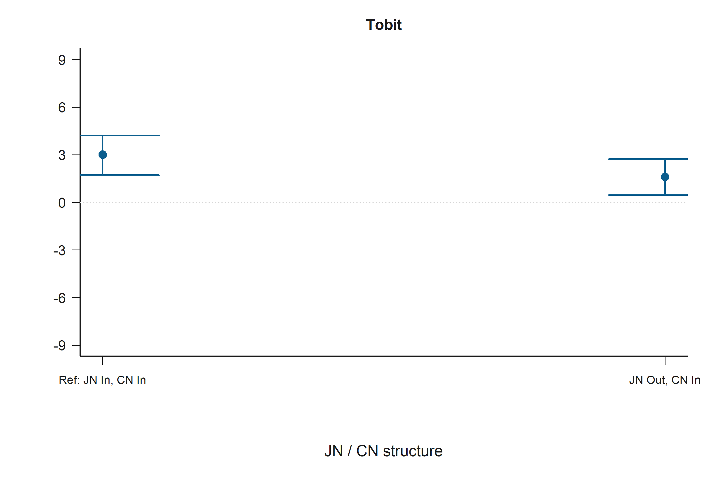

# Behavioral-Economics Style Dynamic Report

Generated on 2026-03-31 15:36:32.

## Materials and Methods

The journal-style report uses the pooled analytical file rather than splitting the narrative by source dataset. The analyzed sample contains 257 participants and 5,140 judgment-by-negotiator observations after preprocessing. Each participant contributes two judgments per scenario, one for each negotiator, so the long-format outcome is defined at the judgment-by-negotiator level throughout.

Role-specific estimation remains central to the design, but it is handled within a single narrative. The victim subset contributes 257 participants, whereas the bystander subset contributes 257 participants. In the victim subset, ingroup/outgroup/control coding is defined relative to the victim-player; in the bystander subset, negotiator-side coding is defined relative to the observer and is paired with the observer-victim ingroup/outgroup relation.

To respect journal space constraints, the report uses four compact tables and five figures, with a fifth table added only when the non-parametric robustness branch is enabled. The figure plan prioritizes the two six-panel descriptive subset figures plus one focal figure each for H1, H2, and H3, selected from the dynamic figure catalog by the lowest Tobit p-value among focal predictors. The table plan prioritizes one design table and one compact results table for each hypothesis family.

The bounded outcome is observed judgment severity on the original -9 to 9 scale. The main estimator is a Tobit model with censoring at the observed bounds and cluster-robust inference by participant id. The robustness branch is included only when the active configuration requests both estimators.

$$y_{isn}^{obs} = \min\{9,\max[-9, y_{isn}^{*}]\}$$

For H1, empathy enters either as the composite score (Model A) or as the four IRI dimensions (Model B), together with judged-negotiator status, counterpart status, decision outcome, subset-relevant victim alignment, and participant controls.

$$y_{isn}^{*} = \alpha_r + \mathbf{E}_i\beta_r + \mathbf{R}_{isn}\gamma_r + \mathbf{X}_i\delta_r + \varepsilon_{isn}$$

For H2, the victim subset uses the joint judged-counterpart structure directly, whereas the bystander subset augments that structure with the observer-victim relation and their interaction.

$$y_{isn,V}^{*} = \alpha_V + \mathbf{S}_{isn}\theta_V + \mathbf{E}_i\beta_V + \mathbf{X}_i\delta_V + \varepsilon_{isn}$$

$$y_{isn,O}^{*} = \alpha_O + \mathbf{S}_{isn}\theta_O + V_{isn}\lambda_O + (\mathbf{S}_{isn}\times V_{isn})\kappa_O + \mathbf{E}_i\beta_O + \mathbf{X}_i\delta_O + \varepsilon_{isn}$$

For H3, empathy is allowed to interact with judged-negotiator status while decision outcome, judged-status-by-decision terms, counterpart structure, and subset-relevant controls remain in the model.

$$y_{isn}^{*} = \alpha_r + \mathbf{E}_i\beta_r + \mathbf{J}_{isn}\eta_r + A_{isn}\pi_r + (\mathbf{E}_i \times \mathbf{J}_{isn})\rho_r + (A_{isn} \times \mathbf{J}_{isn})\tau_r + \mathbf{C}_{isn}\phi_r + \mathbf{X}_i\delta_r + \varepsilon_{isn}$$

The current configuration estimates Tobit as the main model and does not add the non-parametric robustness branch.

Table 1 reports the pooled design and outcome distribution that anchor the rest of the journal-style summary.

| Sample | Participants | Judgments | Judgments / participant | Mean judgment | SD | % at -9 | % at 9 |
| --- | --- | --- | --- | --- | --- | --- | --- |
| Pooled | 257 | 5140 | 20 | 1.62 | 6.66 | 13.5% | 30.2% |
| Victim | 257 | 2570 | 10 | 1.49 | 6.84 | 15.1% | 30.7% |
| Bystander | 257 | 2570 | 10 | 1.75 | 6.48 | 11.8% | 29.6% |

_Note._ Pooled = full analytical long file. Each scenario contributes two judgment observations per participant, one per negotiator. Outcome bounds are the observed censoring points used by the Tobit estimator.

## Results

The descriptive distributions already show why subset-specific estimation matters: the victim and bystander judgment profiles are not identical across the six scenario configurations, even though both are evaluated on the same bounded scale. Figures 1 and 2 therefore retain the subset split at the descriptive level while keeping the narrative pooled and compact.

{ width=6.7in }

{ width=6.7in }

H1 produced the densest and clearest signal pattern. The compact summary in Table 2 focuses on the empathy terms only, using the richer Model B decomposition when available and retaining the composite Model A term whenever it reaches the reporting threshold. In the victim subset, the strongest focal estimates were
PT (B; b = 2.02, p < 0.001; more positive judgments), EC (B; b = -2.64, p < 0.001; more negative judgments), and PD (B; b = 1.68, p = 0.004; more positive judgments).
In the bystander subset, the corresponding focal estimates were
EC (B; b = -1.43, p = 0.045; more negative judgments), PT (B; b = 0.87, p = 0.048; more positive judgments), and PD (B; b = 1.11, p = 0.049; more positive judgments).
Taken together, the H1 pattern indicates that empathy dimensions matter in both subsets, with larger and more differentiated slopes in victim judgments.

| Subset | Model | Predictor | b [95% CI] | p |
| --- | --- | --- | --- | --- |
| Victim | B | PT | 2.02 [1.05, 2.98] | <0.001*** |
| Victim | B | EC | -2.64 [-3.92, -1.36] | <0.001*** |
| Victim | B | PD | 1.68 [0.52, 2.84] | 0.004** |
| Bystander | B | EC | -1.43 [-2.84, -0.03] | 0.045* |
| Bystander | B | PT | 0.87 [0.01, 1.73] | 0.048* |
| Bystander | B | PD | 1.11 [0.01, 2.21] | 0.049* |

_Note._ A = Model A (Emp); B = Model B (FS, EC, PT, PD). JN = judged negotiator; CN = counterpart negotiator; V = observer-victim relation; In = ingroup; Out = outgroup; Ctl = control label hidden; Acc = accepted harmful deal. The table is intentionally restricted to focal empathy estimates reported by the dynamic pipeline.

{ width=6.4in }

H2 yielded a more selective relational pattern than H1. Rather than showing a broad shift across all joint structures, the dynamic results concentrate on a small number of judged-counterpart contrasts, and those contrasts differ by subset. In the victim subset, the most relevant H2 estimate was
JN Ctl, CN In (B; b = -1.89, p = 0.087; more negative judgments).
In the bystander subset, the most relevant H2 estimates were
JN Out, CN In (A; b = -2.36, p = 0.065; more negative judgments) and JN Out, CN In (B; b = -2.20, p = 0.087; more negative judgments).
This role difference is substantively important because the bystander model adds the player-victim relation and its interaction with negotiator-side structure, whereas the victim model does not require that extra layer.

| Subset | Model | Predictor | b [95% CI] | p |
| --- | --- | --- | --- | --- |
| Victim | B | JN Ctl, CN In | -1.89 [-4.07, 0.28] | 0.087+ |
| Bystander | A | JN Out, CN In | -2.36 [-4.87, 0.15] | 0.065+ |
| Bystander | B | JN Out, CN In | -2.20 [-4.71, 0.32] | 0.087+ |

_Note._ A = Model A (Emp); B = Model B (FS, EC, PT, PD). JN = judged negotiator; CN = counterpart negotiator; V = observer-victim relation. Only focal H2 structure and observer-side interaction terms are shown.

{ width=6.4in }

H3 shows that empathy is not merely additive with relational status. Instead, the empathy slope changes with judged-negotiator status, and that moderation is again subset-specific. In the victim subset, the leading H3 interactions were
Emp x JN Out (A; b = -1.73, p = 0.028; more negative judgments), Emp x JN Ctl (A; b = -1.69, p = 0.043; more negative judgments), and EC x JN Out (B; b = -1.89, p = 0.053; more negative judgments).
In the bystander subset, the leading H3 interactions were
Emp x JN Ctl (A; b = 1.71, p = 0.015; more positive judgments) and PD x JN Out (B; b = 1.58, p = 0.021; more positive judgments).
The interaction pattern therefore suggests that empathy-linked evaluation is conditional on who is being judged, not just on the participant's average empathy level.

| Subset | Model | Predictor | b [95% CI] | p |
| --- | --- | --- | --- | --- |
| Victim | A | Emp x JN Out | -1.73 [-3.27, -0.19] | 0.028* |
| Victim | A | Emp x JN Ctl | -1.69 [-3.33, -0.05] | 0.043* |
| Victim | B | EC x JN Out | -1.89 [-3.80, 0.02] | 0.053+ |
| Bystander | A | Emp x JN Ctl | 1.71 [0.33, 3.08] | 0.015* |
| Bystander | B | PD x JN Out | 1.58 [0.24, 2.91] | 0.021* |

_Note._ A = Model A (Emp); B = Model B (FS, EC, PT, PD). JN = judged negotiator; CN = counterpart negotiator; Acc = accepted harmful deal. Only focal H3 empathy-by-judged-status interactions are shown.

{ width=6.4in }

Because the active configuration is Tobit-only, the results section reports the main censored-model estimates without a separate robustness table.

## Limitations

Several limitations qualify the interpretation. First, repeated judgments are clustered within participant, and although the pipeline addresses this with participant-level clustered inference, the design still concentrates multiple morally related responses within the same respondent. Second, the bounded outcome requires censoring-aware estimation because the judgment scale piles up at both -9 and 9. Third, ingroup/outgroup/control coding is relational rather than purely individual, so the same participant can appear in different judged-counterpart structures across scenarios. Fourth, subset-specific formulas are a design strength for identification but they also mean that coefficient blocks are not perfectly symmetric across victim and bystander models.

Because the current configuration does not include the non-parametric branch, robustness to alternative censored estimators is not assessed in this report version.

## Conclusion

Across the pooled analytical sample, the clearest behavioral pattern is that empathy-related variation in judgment is conditional on relational context rather than separable from it. Victim judgments show the strongest empathy gradients, bystander judgments retain smaller but still interpretable empathy effects, H2 highlights a narrower set of role-dependent relational contrasts, and H3 indicates that empathy slopes change with judged-negotiator status. In behavioral terms, moral evaluation in this design is jointly shaped by empathic orientation, the judged negotiator's relational position, and the participant's role in the scenario.

