# Scientific Analysis of Moral Judgments with Tobit and Cluster-Aware Non-Parametric Robustness Checks

## Dataset Description
The empirical foundation of this project rests on two primary experimental datasets: FLORIDA and BUC.  The sample consists of students from both the Floridablanca and Bucaramanga Campuses.  These datasets capture incentivized moral judgments from distinct socio-economic contexts. Participants were presented  with standardized negotiation scenarios where a negotiator's decision resulted in varying degrees of payoff for  themselves, their own group, and a victim group. Under  Option 2: judgment-level relational modeling , each judgment is treated as relational and linked both to a descriptive victim x negotiator scenario shorthand and to hypothesis-specific predictors for judged negotiator status, decision outcome, and additional relational controls.

## Option 2 Relational Case Configuration
All hypothesis sections are now interpreted through negotiator-level relational predictors rather than descriptive case labels.

## Interpretation of Interaction Terms
The models herein employ several predefined predictors. It is important to note how interaction terms are interpreted in the context of this behavioral experiment:

1. **Interaction Subsumption:** When an interaction term is statistically significant, it indicates that the effect of one variable depends on the level of the other. Crucially, if the interaction is significant but the constituent main effects are not explicitly significant, their effects are fully subsumed and contextualized by the interaction.
2. **Continuous by Discrete Interactions:** For terms like `iri_total:judged_outgroup`, a negative coefficient implies that the severity of moral judgment (lower score) induced by higher empathy is steeper (magnified) when evaluating an outgroup negotiator compared to an ingroup negotiator. A positive coefficient would mean empathy makes judgments less severe for the outgroup.
3. **Discrete by Discrete Interactions:** For terms like `judged_outgroup:decision_accept`, a positive coefficient implies that the change in moral judgment when moving from rejecting a deal to accepting a deal is more positive (less morally condemned) for an outgroup negotiator than for an ingroup negotiator.

## Hypothesis Significance Summary
Only hypothesis-relevant predictors with p < 0.10 in the available Tobit models are shown below, split into victim and bystander subset tables. Symbols follow the rule `+` for p < 0.10, `*` for p < 0.05, `**` for p < 0.01, and `***` for p < 0.001. Dynamic figures are generated only for predictors that appear here with at least one significance symbol.
### Victim subset
| Hypothesis | Tobit support |
| --- | --- |
| H1 | Empathy: Perspective taking**; Empathy: Empathic concern**; Empathy: Personal distress+ |
| H2 | None |
| H3 | Personal distress x judged negotiator outgroup*; Empathic concern x judged negotiator outgroup*; Empathy x judged negotiator outgroup*; Empathy x judged negotiator control label hidden+ |

### Bystander subset
| Hypothesis | Tobit support |
| --- | --- |
| H1 | Empathy: Perspective taking*; Empathy: Fantasy scale* |
| H2 | None |
| H3 | Empathy x judged negotiator control label hidden**; Personal distress x judged negotiator outgroup* |

## Significance-Driven Figures
Only hypothesis-relevant predictors that reach at least `p < .10` are visualized automatically. These figures rely on the saved Tobit fits, and `id` remains only an inference-level clustering unit.

### H1: Empathy under relational controls

Empathy: Perspective taking is statistically significant in the Tobit model (**, p = 0.003). The figure below shows that across the observed range, higher Empathy: Perspective taking corresponds to higher predicted judgment.

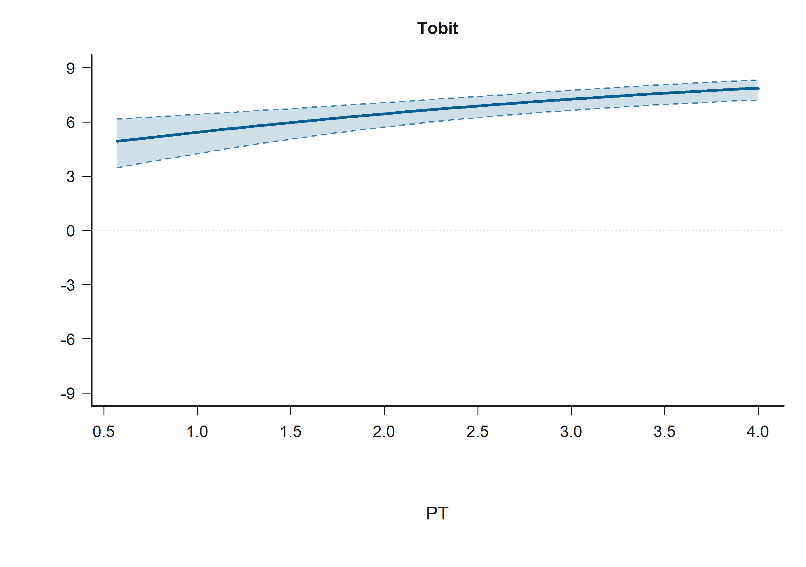

Empathy: Empathic concern is statistically significant in the Tobit model (**, p = 0.004). The figure below shows that across the observed range, higher Empathy: Empathic concern corresponds to lower predicted judgment.

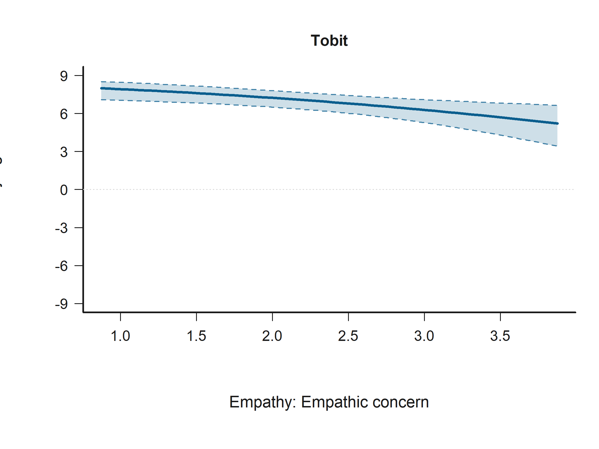

Empathy: Fantasy scale is statistically significant in the Tobit model (*, p = 0.042). The figure below shows that across the observed range, higher Empathy: Fantasy scale corresponds to lower predicted judgment.

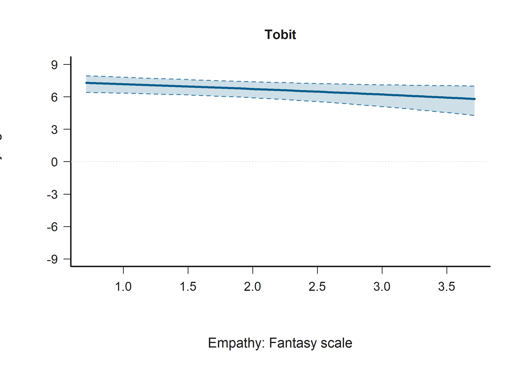

Empathy: Personal distress is statistically significant in the Tobit model (+, p = 0.053). The figure below shows that across the observed range, higher Empathy: Personal distress corresponds to higher predicted judgment.

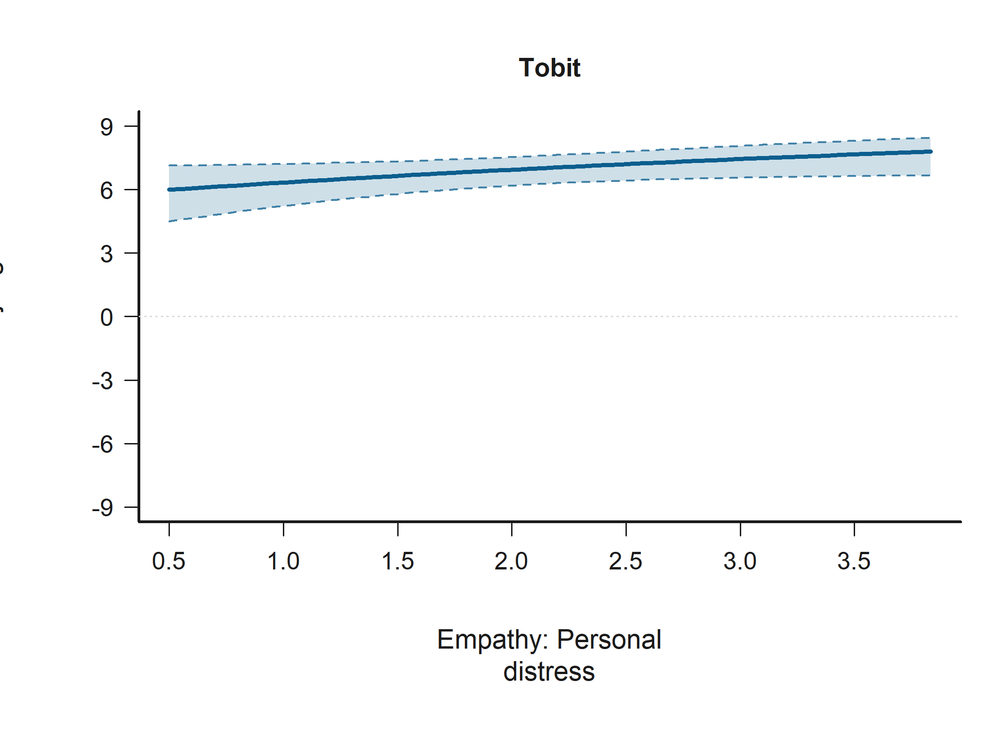

### H3: Empathy x judged-status moderation

Empathy x judged negotiator control label hidden is statistically significant in the Tobit model (**, p = 0.007). The figure below shows that the predicted relationship rises most sharply for Empathy composite (average) when the condition is Judged negotiator control label hidden.

Personal distress x judged negotiator outgroup is statistically significant in the Tobit model (*, p = 0.016). The figure below shows that the predicted relationship rises most sharply for Empathy: Personal distress when the condition is Judged negotiator outgroup.

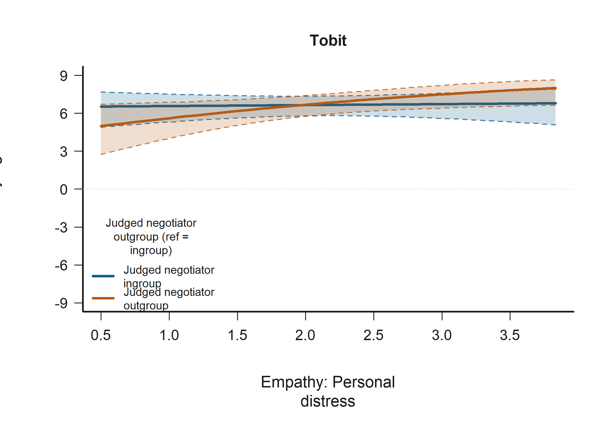

Empathic concern x judged negotiator outgroup is statistically significant in the Tobit model (*, p = 0.026). The figure below shows that the predicted relationship falls most sharply for Empathy: Empathic concern when the condition is Judged negotiator outgroup.

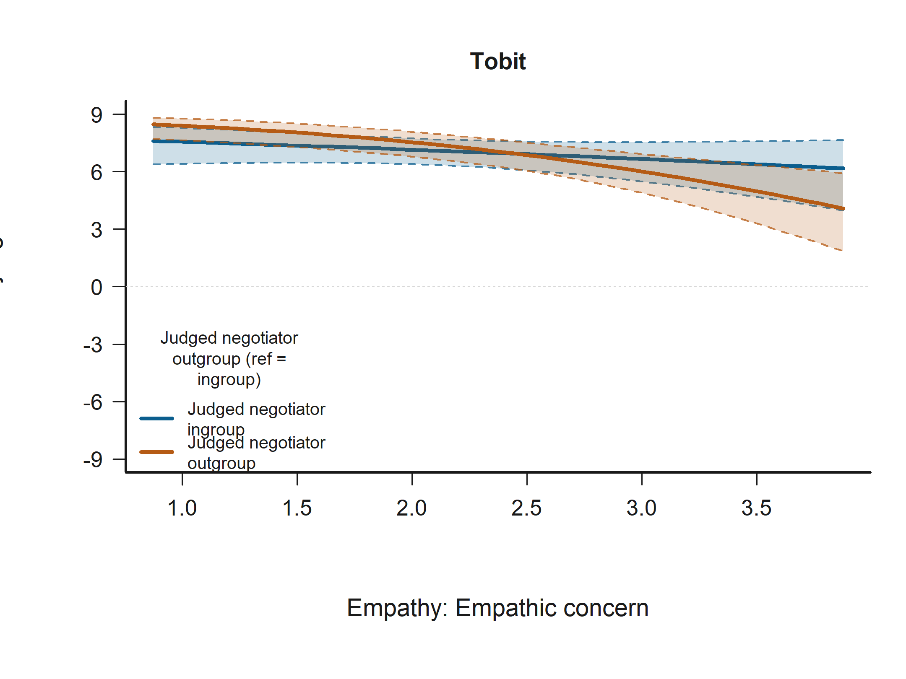

Empathy x judged negotiator outgroup is statistically significant in the Tobit model (*, p = 0.050). The figure below shows that the predicted relationship rises most sharply for Empathy composite (average) when the condition is Judged negotiator ingroup.

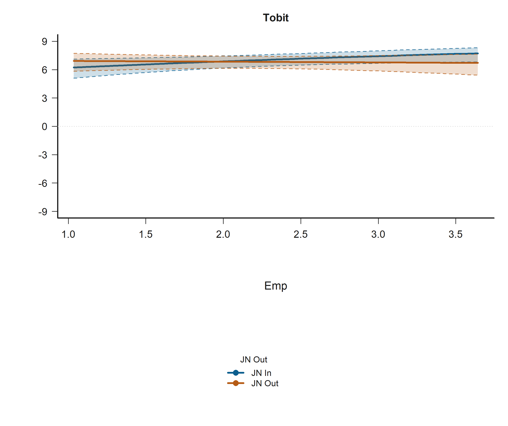

## All Significant Predictors (p < .10)
The following figures extend beyond the hypothesis-target terms and visualize every predictor that reaches `p < .10` in the available H1-H3 Tobit models. This includes significant controls such as age when they clear the threshold.

### judgments_bystander

Negotiator accepted harmful deal is statistically significant in:
- H1: Empathy under relational controls Model A (Tobit)
- H1: Empathy under relational controls Model B (Tobit)
- H2: Judged-status x decision contrasts Model A (Tobit)
- H2: Judged-status x decision contrasts Model B (Tobit)
- H3: Empathy x judged-status moderation Model B (Tobit)
- H3: Empathy x judged-status moderation Model A (Tobit)
The figure below shows that predicted judgment is lower for Accept harmful deal than for Reject harmful deal.

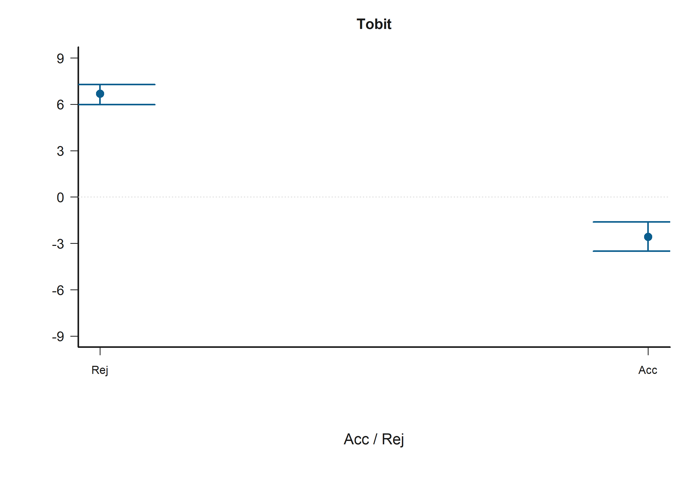

Empathy x judged negotiator control label hidden is statistically significant in:
- H3: Empathy x judged-status moderation Model A (Tobit)
The figure below shows that the predicted relationship rises most sharply for Empathy composite (average) when the condition is Judged negotiator control label hidden.

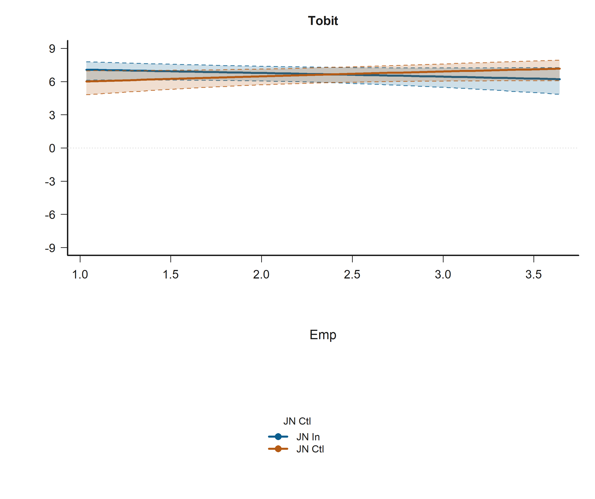

Socioeconomic status is statistically significant in:
- H2: Judged-status x decision contrasts Model A (Tobit)
- H2: Judged-status x decision contrasts Model B (Tobit)
- H1: Empathy under relational controls Model A (Tobit)
- H3: Empathy x judged-status moderation Model A (Tobit)
- H1: Empathy under relational controls Model B (Tobit)
The figure below shows that predicted judgment is higher for Socioeconomic status 5 than for Socioeconomic status 0.

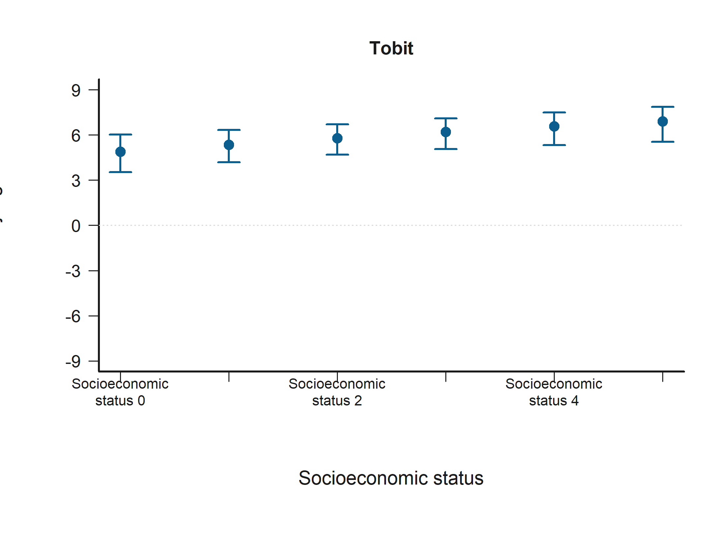

Judged negotiator control label hidden (ref = ingroup) is statistically significant in:
- H3: Empathy x judged-status moderation Model A (Tobit)
- H3: Empathy x judged-status moderation Model B (Tobit)
The figure below shows that predicted judgment is higher for Judged negotiator control label hidden than for Judged negotiator ingroup.

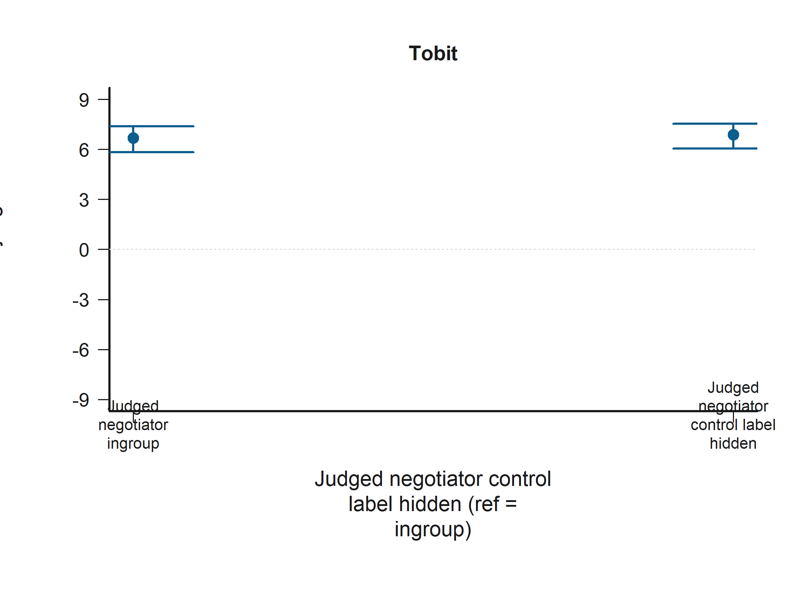

Personal distress x judged negotiator outgroup is statistically significant in:
- H3: Empathy x judged-status moderation Model B (Tobit)
The figure below shows that the predicted relationship rises most sharply for Empathy: Personal distress when the condition is Judged negotiator outgroup.

Engineering participant (ref = humanities) is statistically significant in:
- H2: Judged-status x decision contrasts Model A (Tobit)
- H1: Empathy under relational controls Model A (Tobit)
- H3: Empathy x judged-status moderation Model A (Tobit)
- H2: Judged-status x decision contrasts Model B (Tobit)
- H1: Empathy under relational controls Model B (Tobit)
- H3: Empathy x judged-status moderation Model B (Tobit)
The figure below shows that predicted judgment is higher for Engineering participant than for Humanities participant.

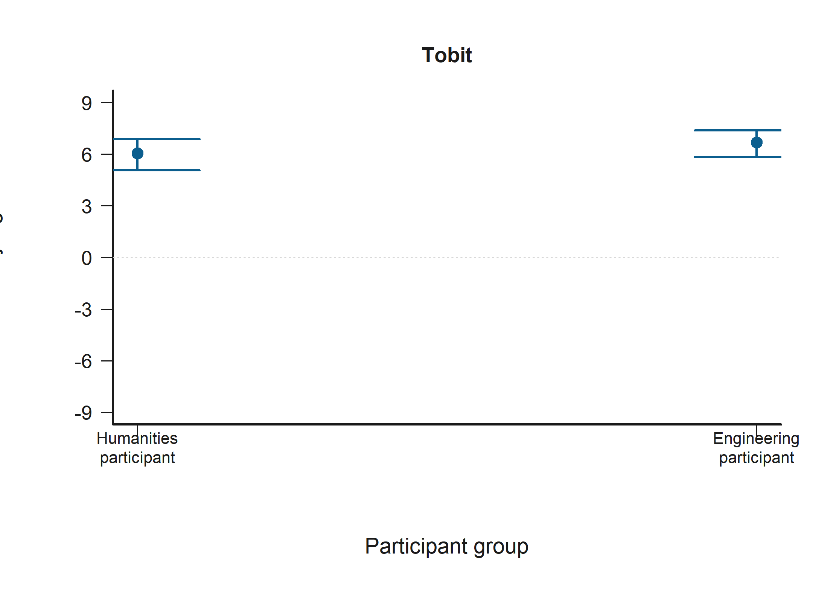

Counterpart negotiator control label hidden (ref = ingroup) is statistically significant in:
- H1: Empathy under relational controls Model B (Tobit)
- H2: Judged-status x decision contrasts Model B (Tobit)
- H1: Empathy under relational controls Model A (Tobit)
- H2: Judged-status x decision contrasts Model A (Tobit)
- H3: Empathy x judged-status moderation Model B (Tobit)
- H3: Empathy x judged-status moderation Model A (Tobit)
The figure below shows that predicted judgment is higher for Counterpart negotiator control label hidden than for Counterpart negotiator ingroup.

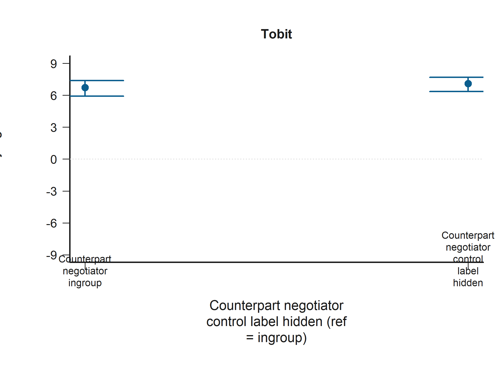

Empathy: Perspective taking is statistically significant in:
- H1: Empathy under relational controls Model B (Tobit)
- H2: Judged-status x decision contrasts Model B (Tobit)
- H3: Empathy x judged-status moderation Model B (Tobit)
The figure below shows that across the observed range, higher Empathy: Perspective taking corresponds to higher predicted judgment.

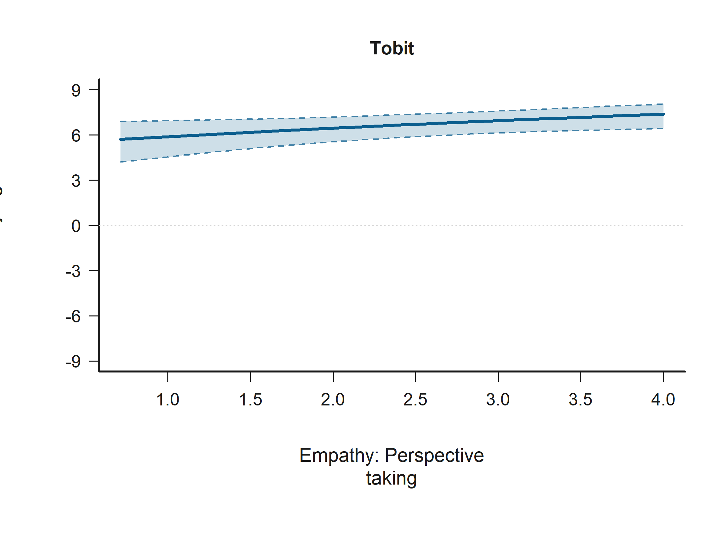

Empathy: Fantasy scale is statistically significant in:
- H1: Empathy under relational controls Model B (Tobit)
- H2: Judged-status x decision contrasts Model B (Tobit)
- H3: Empathy x judged-status moderation Model B (Tobit)
The figure below shows that across the observed range, higher Empathy: Fantasy scale corresponds to lower predicted judgment.

Empathy composite (average) is statistically significant in:
- H2: Judged-status x decision contrasts Model A (Tobit)
The figure below shows that across the observed range, higher Empathy composite (average) corresponds to lower predicted judgment.

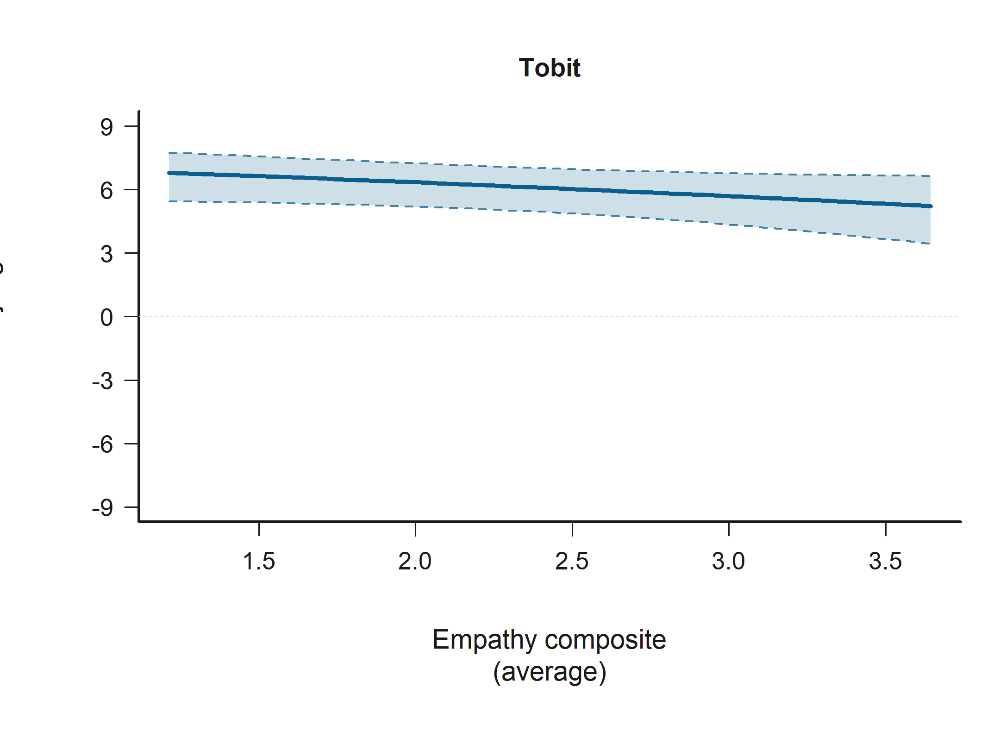

### judgments_victim

Negotiator accepted harmful deal is statistically significant in:
- H1: Empathy under relational controls Model B (Tobit)
- H1: Empathy under relational controls Model A (Tobit)
- H2: Judged-status x decision contrasts Model B (Tobit)
- H3: Empathy x judged-status moderation Model B (Tobit)
- H2: Judged-status x decision contrasts Model A (Tobit)
- H3: Empathy x judged-status moderation Model A (Tobit)
The figure below shows that predicted judgment is lower for Accept harmful deal than for Reject harmful deal.

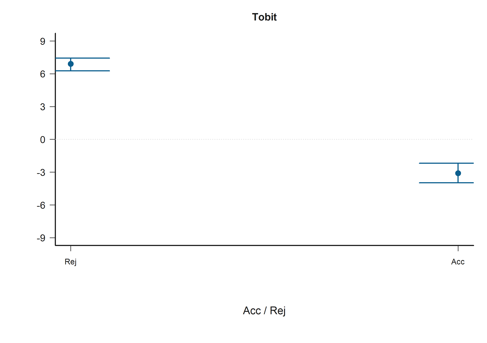

Empathy: Perspective taking is statistically significant in:
- H1: Empathy under relational controls Model B (Tobit)
- H2: Judged-status x decision contrasts Model B (Tobit)
- H3: Empathy x judged-status moderation Model B (Tobit)
The figure below shows that across the observed range, higher Empathy: Perspective taking corresponds to higher predicted judgment.

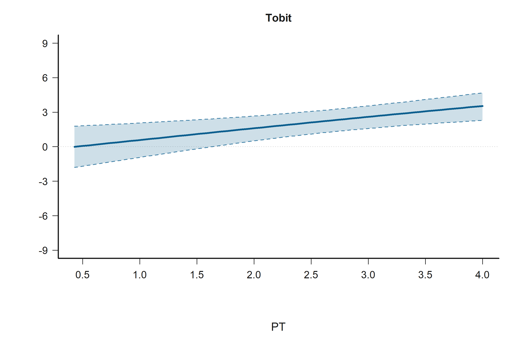

Empathy: Empathic concern is statistically significant in:
- H2: Judged-status x decision contrasts Model B (Tobit)
- H1: Empathy under relational controls Model B (Tobit)
The figure below shows that across the observed range, higher Empathy: Empathic concern corresponds to lower predicted judgment.

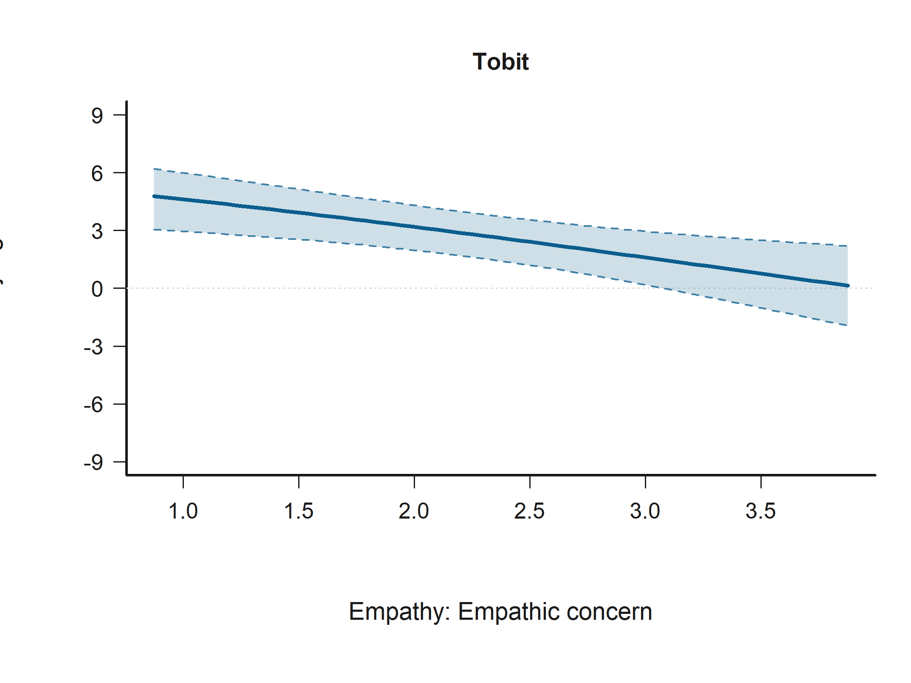

Judged negotiator outgroup (ref = ingroup) is statistically significant in:
- H3: Empathy x judged-status moderation Model B (Tobit)
- H3: Empathy x judged-status moderation Model A (Tobit)
The figure below shows that predicted judgment is higher for Judged negotiator outgroup than for Judged negotiator ingroup.

Personal distress x judged negotiator outgroup is statistically significant in:
- H3: Empathy x judged-status moderation Model B (Tobit)
The figure below shows that the predicted relationship rises most sharply for Empathy: Personal distress when the condition is Judged negotiator outgroup.

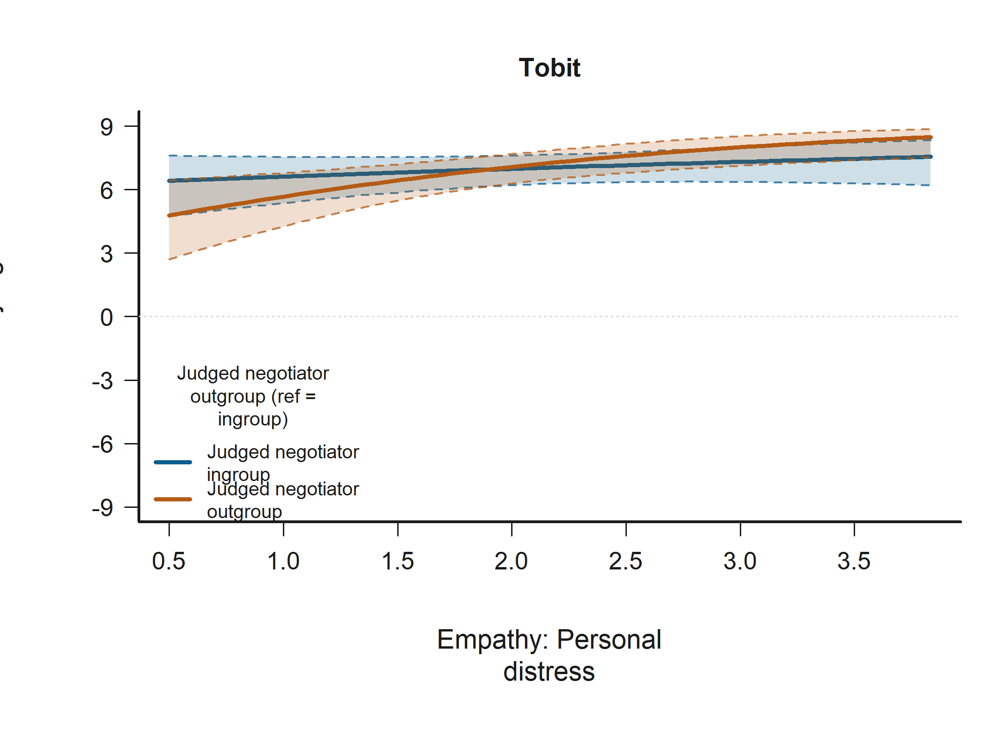

Empathic concern x judged negotiator outgroup is statistically significant in:
- H3: Empathy x judged-status moderation Model B (Tobit)
The figure below shows that the predicted relationship falls most sharply for Empathy: Empathic concern when the condition is Judged negotiator outgroup.

Engineering participant (ref = humanities) is statistically significant in:
- H3: Empathy x judged-status moderation Model A (Tobit)
- H1: Empathy under relational controls Model A (Tobit)
- H3: Empathy x judged-status moderation Model B (Tobit)
- H1: Empathy under relational controls Model B (Tobit)
- H2: Judged-status x decision contrasts Model A (Tobit)
- H2: Judged-status x decision contrasts Model B (Tobit)
The figure below shows that predicted judgment is higher for Engineering participant than for Humanities participant.

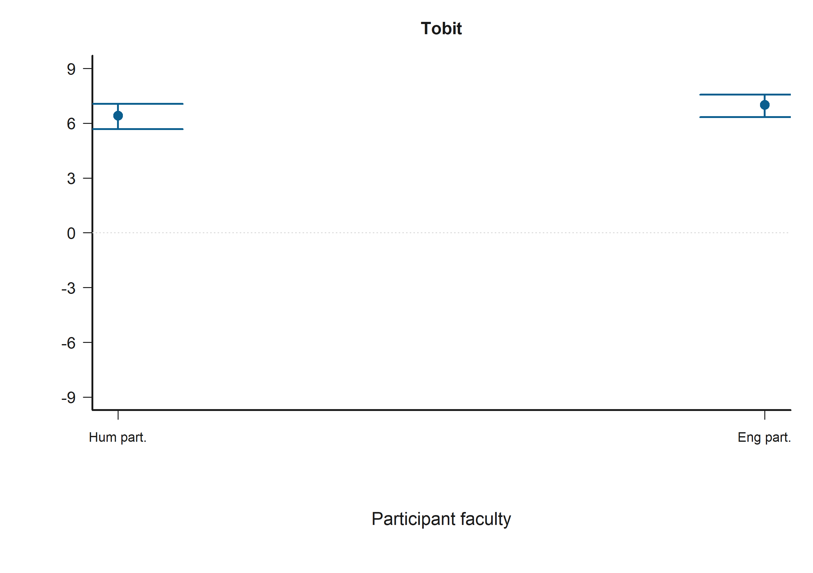

Empathy composite (average) is statistically significant in:
- H3: Empathy x judged-status moderation Model A (Tobit)
- H2: Judged-status x decision contrasts Model A (Tobit)
The figure below shows that across the observed range, higher Empathy composite (average) corresponds to higher predicted judgment.

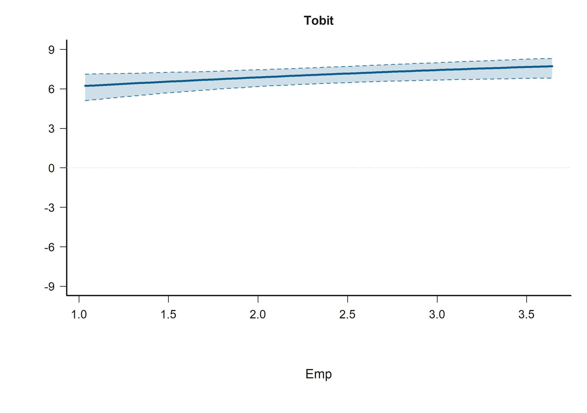

Empathy x judged negotiator outgroup is statistically significant in:
- H3: Empathy x judged-status moderation Model A (Tobit)
The figure below shows that the predicted relationship rises most sharply for Empathy composite (average) when the condition is Judged negotiator ingroup.

Empathy: Personal distress is statistically significant in:
- H2: Judged-status x decision contrasts Model B (Tobit)
- H1: Empathy under relational controls Model B (Tobit)
The figure below shows that across the observed range, higher Empathy: Personal distress corresponds to higher predicted judgment.

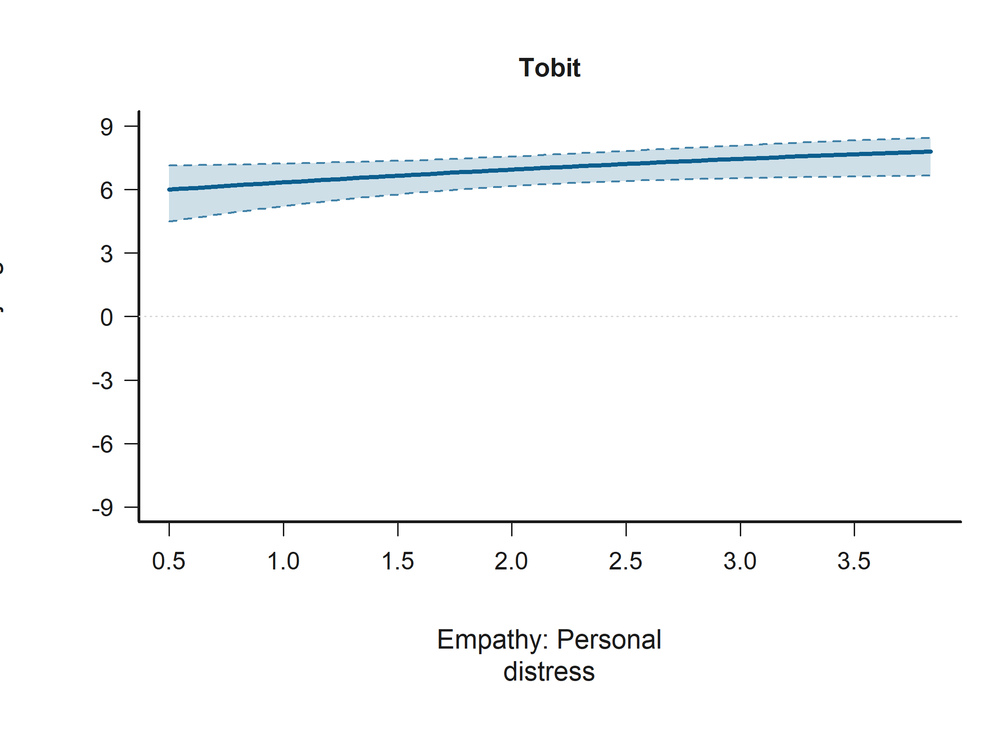

Age is statistically significant in:
- H3: Empathy x judged-status moderation Model A (Tobit)
- H2: Judged-status x decision contrasts Model A (Tobit)
- H1: Empathy under relational controls Model A (Tobit)
The figure below shows that across the observed range, higher Age corresponds to higher predicted judgment.

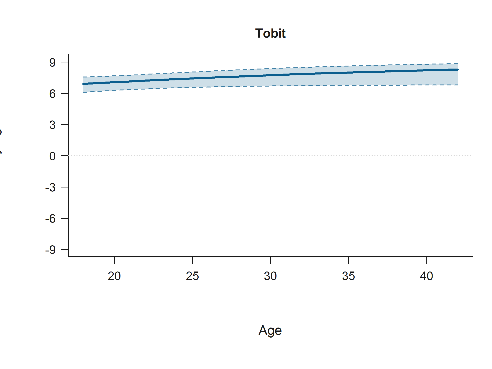

Empathy x judged negotiator control label hidden is statistically significant in:
- H3: Empathy x judged-status moderation Model A (Tobit)
The figure below shows that the predicted relationship rises most sharply for Empathy composite (average) when the condition is Judged negotiator ingroup.

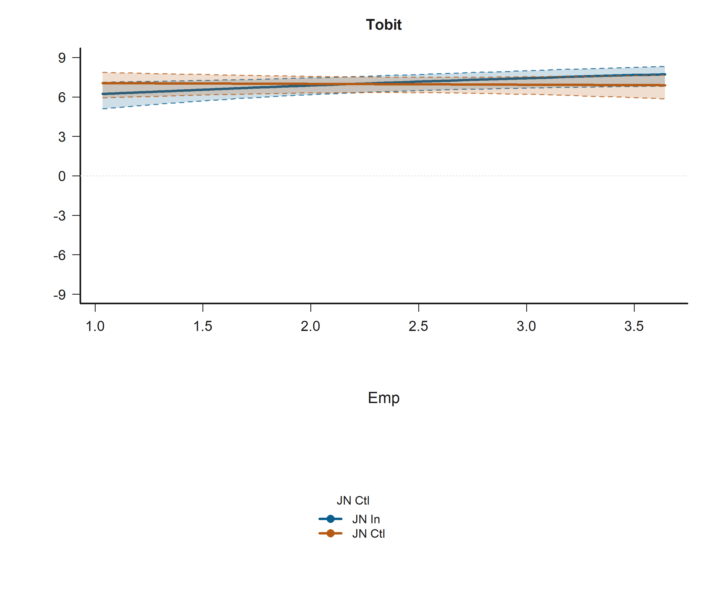

Judged negotiator control label hidden (ref = ingroup) is statistically significant in:
- H3: Empathy x judged-status moderation Model B (Tobit)
The figure below shows that predicted judgment is higher for Judged negotiator control label hidden than for Judged negotiator ingroup.

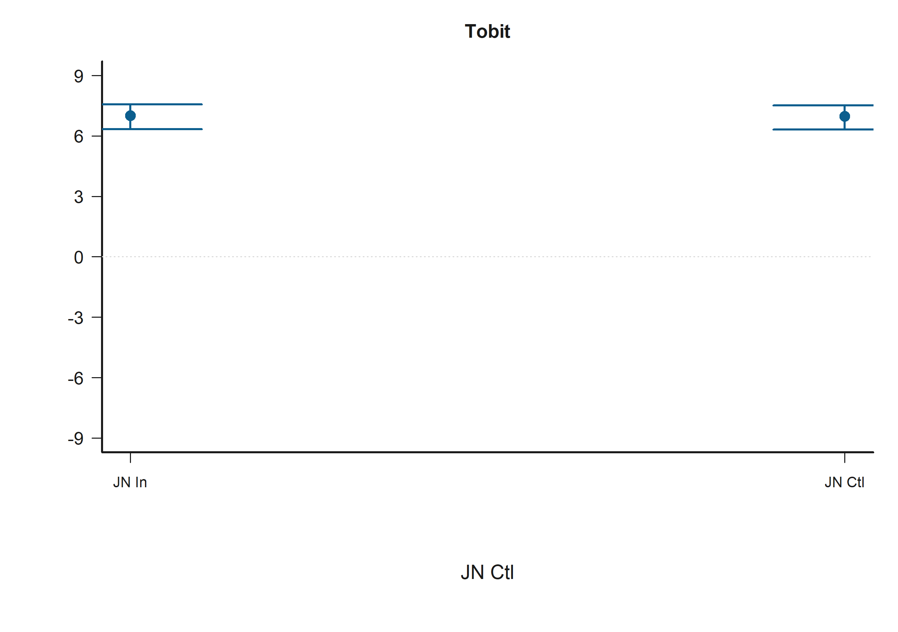

## Hypothesis Conclusion Summary
Each conclusion below is generated from the current Tobit coefficient outputs.
- H1. Original hypothesis: Within the victim and bystander subsets, higher empathy predicts lower moral-judgment scores for harmful decisions after conditioning on judged-negotiator status, counterpart status, decision outcome, observer-side victim alignment when applicable, and participant controls. Victim subset: Tobit conclusion: the evidence is mixed but offers partial support for the hypothesis. Model A does not support the hypothesis; Empathy composite (average) is positive but not statistically significant (p = 0.417). Model B supports the hypothesis through Empathy: Empathic concern with a negative association (p = 0.004). Additional statistically significant signals include Negotiator accepted harmful deal with a negative association (p < 0.001) and Engineering participant (ref = humanities) with a positive association (p = 0.035). Bystander subset: Tobit conclusion: the evidence is mixed but offers partial support for the hypothesis. Model A does not support the hypothesis; Empathy composite (average) is negative but not statistically significant (p = 0.800). Model B supports the hypothesis through Empathy: Fantasy scale with a negative association (p = 0.042). Additional statistically significant signals include Negotiator accepted harmful deal with a negative association (p < 0.001) and Engineering participant (ref = humanities) with a positive association (p = 0.017).
- H2a. Original hypothesis: Moral-judgment severity should vary with the judged negotiator's ingroup-versus-outgroup status, and that relational effect should depend on whether the harmful deal was accepted or rejected. Victim subset: Tobit conclusion: the available models do not support the hypothesis. Model A does not support the hypothesis; none of the judged-negotiator relational-status terms and their decision interaction in the non-control sample are statistically significant, and the closest signal is Accepted harmful deal x judged negotiator outgroup with a positive association (p = 0.457). Model B does not support the hypothesis; none of the judged-negotiator relational-status terms and their decision interaction in the non-control sample are statistically significant, and the closest signal is Accepted harmful deal x judged negotiator outgroup with a positive association (p = 0.631). Additional statistically significant signals include Negotiator accepted harmful deal with a negative association (p < 0.001) and Empathy: Perspective taking with a positive association (p = 0.018). Bystander subset: Tobit conclusion: the available models do not support the hypothesis. Model A does not support the hypothesis; none of the judged-negotiator relational-status terms and their decision interaction in the non-control sample are statistically significant, and the closest signal is Accepted harmful deal x judged negotiator outgroup with a negative association (p = 0.804). Model B does not support the hypothesis; none of the judged-negotiator relational-status terms and their decision interaction in the non-control sample are statistically significant, and the closest signal is Accepted harmful deal x judged negotiator outgroup with a negative association (p = 0.769). Additional statistically significant signals include Negotiator accepted harmful deal with a negative association (p < 0.001) and Socioeconomic status with a positive association (p = 0.011).
- H2b. Original hypothesis: Moral-judgment severity should vary with the judged negotiator's ingroup-versus-outgroup-versus-control status, and that relational effect should depend on whether the harmful deal was accepted or rejected. Victim subset: Tobit conclusion: the available models do not support the hypothesis. Model A does not support the hypothesis; none of the judged-negotiator relational-status terms and their decision interaction in the full sample are statistically significant, and the closest signal is Accepted harmful deal x judged negotiator control label hidden with a positive association (p = 0.407). Model B does not support the hypothesis; none of the judged-negotiator relational-status terms and their decision interaction in the full sample are statistically significant, and the closest signal is Accepted harmful deal x judged negotiator control label hidden with a positive association (p = 0.447). Additional statistically significant signals include Negotiator accepted harmful deal with a negative association (p < 0.001) and Empathy: Perspective taking with a positive association (p = 0.003). Bystander subset: Tobit conclusion: the available models do not support the hypothesis. Model A does not support the hypothesis; none of the judged-negotiator relational-status terms and their decision interaction in the full sample are statistically significant, and the closest signal is Accepted harmful deal x judged negotiator outgroup with a negative association (p = 0.489). Model B does not support the hypothesis; none of the judged-negotiator relational-status terms and their decision interaction in the full sample are statistically significant, and the closest signal is Accepted harmful deal x judged negotiator outgroup with a negative association (p = 0.433). Additional statistically significant signals include Negotiator accepted harmful deal with a negative association (p < 0.001) and Engineering participant (ref = humanities) with a positive association (p = 0.016).
- H3. Original hypothesis: The empathy effect may vary according to whether the judged negotiator is ingroup, outgroup, or control, while decision outcome and the additional relational controls remain explicitly modeled. Victim subset: Tobit conclusion: the available models support the hypothesis. Model A supports the hypothesis through Empathy x judged negotiator outgroup with a negative association (p = 0.050). Model B supports the hypothesis through Personal distress x judged negotiator outgroup with a positive association (p = 0.026) and Empathic concern x judged negotiator outgroup with a negative association (p = 0.026). Additional statistically significant signals include Negotiator accepted harmful deal with a negative association (p < 0.001) and Empathy: Perspective taking with a positive association (p = 0.008). Bystander subset: Tobit conclusion: the available models support the hypothesis. Model A supports the hypothesis through Empathy x judged negotiator control label hidden with a positive association (p = 0.007). Model B supports the hypothesis through Personal distress x judged negotiator outgroup with a positive association (p = 0.016). Additional statistically significant signals include Negotiator accepted harmful deal with a negative association (p < 0.001) and Judged negotiator control label hidden (ref = ingroup) with a negative association (p = 0.013).

## PDF Comprehensive Report Generated
Please check `tobit_analysis_report.pdf` in the `outputs/report/` folder for the fully documented Tobit and cluster-aware non-parametric mathematical formulations, the Option 2 relational-variable logic, dual-estimator hypothesis testing, and the algorithmically interpreted natural language coefficients. When the run is dataset-specific, a matching alias such as `tobit_analysis_report_Buca.pdf` is also refreshed.

