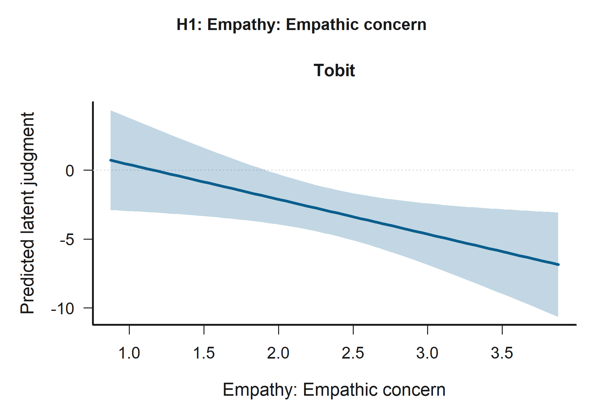
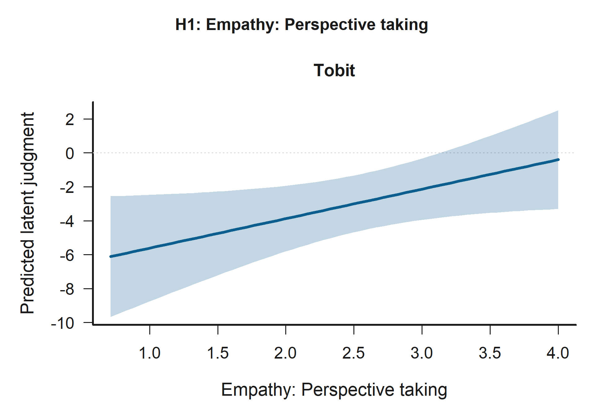
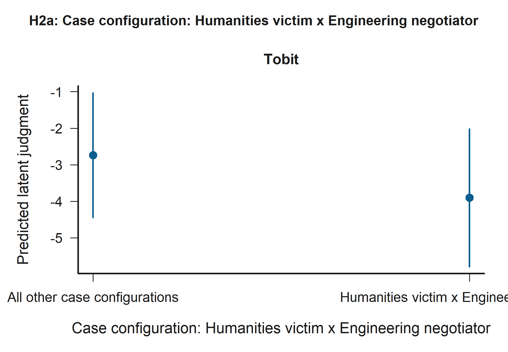
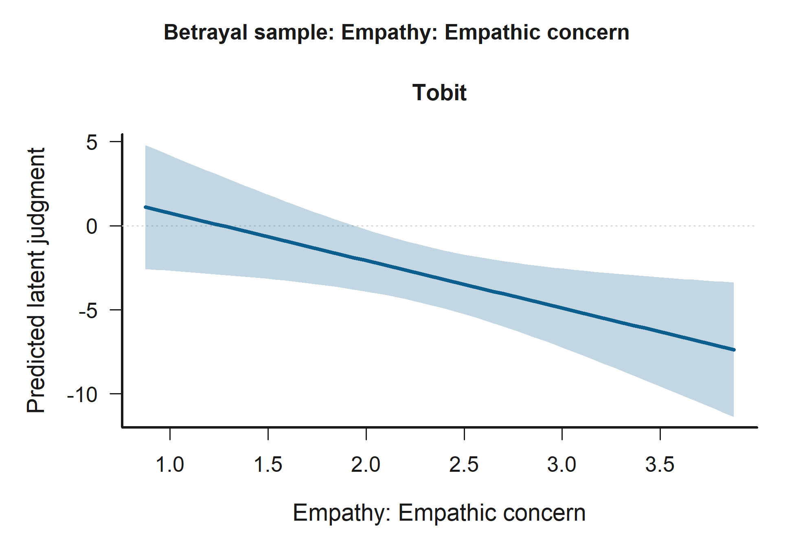
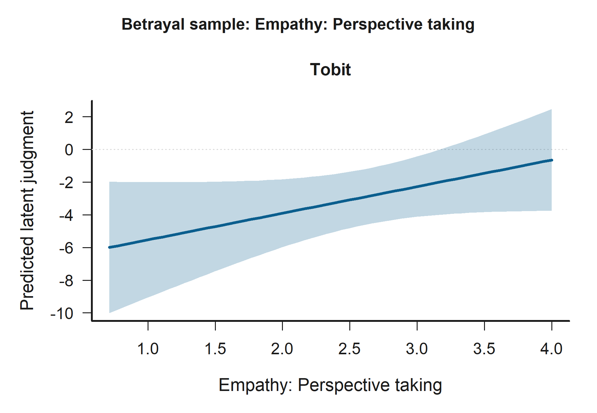

# Scientific Analysis of Moral Judgments with Tobit and Cluster-Aware Non-Parametric Robustness Checks

## Dataset Description
The empirical foundation of this project rests on two primary experimental datasets: FLORIDA and BUC.  The sample consists of students from the Bucaramanga Campus.  These datasets capture incentivized moral judgments from distinct socio-economic contexts. Participants were presented  with standardized negotiation scenarios where a negotiator's decision resulted in varying degrees of payoff for  themselves, their own group, and a victim group. Under  Option 2: explicit case-configuration modeling , each judgment is treated as relational and indexed by an explicit victim x negotiator scenario configuration rather than by isolated ingroup/outgroup attributes.

## Option 2 Relational Case Configuration
Option 2 replaces isolated ingroup/outgroup indicators with explicit relational case configurations built from the paired-group structure of each judgment. The current project records the victim group first and the judged negotiator label second, so configurations such as Hum_x_Hum, Hum_x_Ing, Hum_x_Control, Ing_x_Hum, Ing_x_Ing, Ing_x_Control refer to victim x negotiator combinations rather than detached attributes. Role (Observer/Victim) and decision context (Accept/Reject) may further condition these scenarios and are reported explicitly in the descriptive summaries.

## Hypothesis Significance Summary
Only hypothesis-relevant predictors with p < 0.10 are shown below. Symbols follow the rule `+` for p < 0.10, `*` for p < 0.05, and `**` for p < 0.01. If bootstrap is disabled for a run, too few non-parametric bootstrap refits succeed, or the non-parametric fit does not converge, the non-parametric column reports that status explicitly. Dynamic figures are generated only for predictors that appear here with at least one significance symbol.
| Hypothesis | Tobit significant predictors | Non-parametric significant predictors |
| --- | --- | --- |
| Higher empathy predicts lower moral-judgment scores for harmful decisions after conditioning on explicit victim x negotiator case configurations. | Empathy: Empathic concern*; Empathy: Perspective taking* | None |
| Same-faculty and cross-faculty betrayal cases are evaluated through explicit victim x negotiator configurations rather than a single same_group_harm flag. | Case configuration: Humanities victim x Engineering negotiator+ | Bootstrap too sparse |
| Relational judgments are interpreted through explicit victim x negotiator case configurations such as Hum_x_Ing, Hum_x_Control, Ing_x_Hum, Ing_x_Ing, and Ing_x_Control. | Case configuration: Humanities victim x Engineering negotiator+ | None |
| The empathy effect may vary across explicit victim x negotiator pairings, so moderation is modeled through empathy interactions with case-configuration contrasts. | Case configuration: Engineering victim x Humanities negotiator x Empathy: Empathic concern**; Case configuration: Engineering victim x Humanities negotiator x Empathy: Personal distress*; Case configuration: Humanities victim x Engineering negotiator x Empathy composite (average)*; Case configuration: Engineering victim x Control label hidden negotiator x Empathy: Empathic concern+; Case configuration: Engineering victim x Humanities negotiator x Empathy composite (average)+ | None |

## Case Configuration Summary
| case_configuration | role | decision_accept | Observations | MeanJudgement | SDJudgement | SEJudgement | Lower95 | Upper95 |
| --- | --- | --- | --- | --- | --- | --- | --- | --- |
| Hum_x_Control | observer | 0 | 168 | 6.417 | 4.066 | 0.314 | 5.802 | 7.032 |
| Hum_x_Hum | observer | 0 | 142 | 6.873 | 3.496 | 0.293 | 6.298 | 7.448 |
| Hum_x_Ing | observer | 0 | 157 | 6.172 | 3.558 | 0.284 | 5.615 | 6.728 |
| Ing_x_Control | observer | 0 | 192 | 6.547 | 3.410 | 0.246 | 6.064 | 7.029 |
| Ing_x_Hum | observer | 0 | 169 | 5.757 | 4.510 | 0.347 | 5.077 | 6.437 |
| Ing_x_Ing | observer | 0 | 187 | 6.636 | 3.601 | 0.263 | 6.120 | 7.152 |
| Hum_x_Control | victim | 0 | 136 | 6.088 | 4.153 | 0.356 | 5.390 | 6.786 |
| Hum_x_Hum | victim | 0 | 143 | 5.259 | 4.616 | 0.386 | 4.502 | 6.015 |
| Hum_x_Ing | victim | 0 | 116 | 6.534 | 3.559 | 0.330 | 5.887 | 7.182 |
| Ing_x_Control | victim | 0 | 207 | 6.744 | 3.696 | 0.257 | 6.241 | 7.247 |
| Ing_x_Hum | victim | 0 | 215 | 6.637 | 3.891 | 0.265 | 6.117 | 7.157 |
| Ing_x_Ing | victim | 0 | 209 | 7.005 | 3.575 | 0.247 | 6.520 | 7.490 |
| Hum_x_Control | observer | 1 | 137 | -3.044 | 5.123 | 0.438 | -3.902 | -2.186 |
| Hum_x_Hum | observer | 1 | 150 | -3.573 | 4.453 | 0.364 | -4.286 | -2.861 |
| Hum_x_Ing | observer | 1 | 148 | -3.757 | 4.972 | 0.409 | -4.558 | -2.956 |
| Ing_x_Control | observer | 1 | 173 | -3.012 | 4.767 | 0.362 | -3.722 | -2.301 |
| Ing_x_Hum | observer | 1 | 178 | -2.596 | 5.421 | 0.406 | -3.392 | -1.799 |
| Ing_x_Ing | observer | 1 | 189 | -3.063 | 4.986 | 0.363 | -3.774 | -2.353 |
| Hum_x_Control | victim | 1 | 129 | -4.054 | 4.931 | 0.434 | -4.905 | -3.203 |
| Hum_x_Hum | victim | 1 | 122 | -3.434 | 4.846 | 0.439 | -4.294 | -2.574 |
| Hum_x_Ing | victim | 1 | 126 | -4.825 | 4.427 | 0.394 | -5.598 | -4.052 |
| Ing_x_Control | victim | 1 | 238 | -2.824 | 5.658 | 0.367 | -3.542 | -2.105 |
| Ing_x_Hum | victim | 1 | 177 | -3.424 | 5.606 | 0.421 | -4.250 | -2.598 |
| Ing_x_Ing | victim | 1 | 172 | -4.250 | 4.678 | 0.357 | -4.949 | -3.551 |

## Significance-Driven Figures
Only hypothesis-relevant predictors that reach at least `p < .10` are visualized automatically. These figures rely on the saved Tobit and clustered non-parametric fits, and `id` remains only an inference-level clustering unit.

### H1: Empathy under explicit case configuration

Empathy: Empathic concern is statistically significant in the Tobit model (*, p = 0.025). The figure below shows that across the observed range, higher Empathy: Empathic concern corresponds to lower predicted latent judgment.

Empathy: Perspective taking is statistically significant in the Tobit model (*, p = 0.042). The figure below shows that across the observed range, higher Empathy: Perspective taking corresponds to higher predicted latent judgment.

### H2a: Relational betrayal contrasts

Case configuration: Humanities victim x Engineering negotiator is statistically significant in the Tobit model (+, p = 0.061). The figure below shows that predicted latent judgment is lower for Humanities victim x Engineering negotiator than for All other case configurations.

### H2b: Explicit case-configuration contrasts

Case configuration: Humanities victim x Engineering negotiator is statistically significant in the Tobit model (+, p = 0.065). The figure below shows that predicted latent judgment is lower for Humanities victim x Engineering negotiator than for All other case configurations.

### H3: Empathy x case-configuration moderation

Case configuration: Engineering victim x Humanities negotiator x Empathy: Empathic concern is statistically significant in the Tobit model (**, p < 0.001). The figure below shows that the predicted relationship falls most sharply for Empathy: Empathic concern when the condition is Engineering victim x Humanities negotiator.

Case configuration: Engineering victim x Humanities negotiator x Empathy: Personal distress is statistically significant in the Tobit model (*, p = 0.015). The figure below shows that the predicted relationship rises most sharply for Empathy: Personal distress when the condition is Engineering victim x Humanities negotiator.

Case configuration: Humanities victim x Engineering negotiator x Empathy composite (average) is statistically significant in the Tobit model (*, p = 0.049). The figure below shows that the predicted relationship falls most sharply for Empathy composite (average) when the condition is Humanities victim x Engineering negotiator.

Case configuration: Engineering victim x Control label hidden negotiator x Empathy: Empathic concern is statistically significant in the Tobit model (+, p = 0.055). The figure below shows that the predicted relationship falls most sharply for Empathy: Empathic concern when the condition is Engineering victim x Control label hidden negotiator.

Case configuration: Engineering victim x Humanities negotiator x Empathy composite (average) is statistically significant in the Tobit model (+, p = 0.080). The figure below shows that the predicted relationship falls most sharply for Empathy composite (average) when the condition is Engineering victim x Humanities negotiator.

## All Significant Predictors (p < .10)
The following figures extend beyond the hypothesis-target terms and visualize every predictor that reaches `p < .10` in the available H1-H3 Tobit or clustered non-parametric models. This includes significant controls such as age when they clear the threshold.

### Accepted-decision sample

Case configuration: Engineering victim x Humanities negotiator x Empathy: Empathic concern is statistically significant in H3: Empathy x case-configuration moderation Model B (Tobit). The figure below shows that the predicted relationship falls most sharply for Empathy: Empathic concern when the condition is Engineering victim x Humanities negotiator.

Observer role (ref = victim) is statistically significant in H2b: Explicit case-configuration contrasts Model A (Tobit), H1: Empathy under explicit case configuration Model A (Tobit), H3: Empathy x case-configuration moderation Model A (Tobit), H2b: Explicit case-configuration contrasts Model B (Tobit), H1: Empathy under explicit case configuration Model B (Tobit), and H3: Empathy x case-configuration moderation Model B (Tobit). The figure below shows that predicted latent judgment is higher for Observer role than for Victim role.

![Grouped Prediction Plot for Observer role (ref = victim) in the Accepted-decision sample. Statistically significant support appears in H2b: Explicit case-configuration contrasts Model A (Tobit), H1: Empathy under explicit case configuration Model A (Tobit), H3: Empathy x case-configuration moderation Model A (Tobit), H2b: Explicit case-configuration contrasts Model B (Tobit), H1: Empathy under explicit case configuration Model B (Tobit), and H3: Empathy x case-configuration moderation Model B (Tobit). The panels show predicted latent judgments with 95% confidence intervals.](../figures/figure_sig_all_accepted_decision_sample_role_observer.png)

Case configuration: Engineering victim x Humanities negotiator x Empathy: Personal distress is statistically significant in H3: Empathy x case-configuration moderation Model B (Tobit). The figure below shows that the predicted relationship rises most sharply for Empathy: Personal distress when the condition is Engineering victim x Humanities negotiator.

Empathy: Empathic concern is statistically significant in H1: Empathy under explicit case configuration Model B (Tobit) and H2b: Explicit case-configuration contrasts Model B (Tobit). The figure below shows that across the observed range, higher Empathy: Empathic concern corresponds to lower predicted latent judgment.

Age is statistically significant in H3: Empathy x case-configuration moderation Model A (Tobit), H1: Empathy under explicit case configuration Model A (Tobit), H2b: Explicit case-configuration contrasts Model A (Tobit), H2b: Explicit case-configuration contrasts Model B (Tobit), H1: Empathy under explicit case configuration Model B (Tobit), and H3: Empathy x case-configuration moderation Model B (Tobit). The figure below shows that across the observed range, higher Age corresponds to higher predicted latent judgment.

![Effect Plot for Age in the Accepted-decision sample. Statistically significant support appears in H3: Empathy x case-configuration moderation Model A (Tobit), H1: Empathy under explicit case configuration Model A (Tobit), H2b: Explicit case-configuration contrasts Model A (Tobit), H2b: Explicit case-configuration contrasts Model B (Tobit), H1: Empathy under explicit case configuration Model B (Tobit), and H3: Empathy x case-configuration moderation Model B (Tobit). The panels show predicted latent judgments with 95% confidence intervals.](../figures/figure_sig_all_accepted_decision_sample_age.png)

Empathy: Perspective taking is statistically significant in H2b: Explicit case-configuration contrasts Model B (Tobit) and H1: Empathy under explicit case configuration Model B (Tobit). The figure below shows that across the observed range, higher Empathy: Perspective taking corresponds to higher predicted latent judgment.

Case configuration: Humanities victim x Engineering negotiator x Empathy composite (average) is statistically significant in H3: Empathy x case-configuration moderation Model A (Tobit). The figure below shows that the predicted relationship falls most sharply for Empathy composite (average) when the condition is Humanities victim x Engineering negotiator.

Case configuration: Engineering victim x Control label hidden negotiator x Empathy: Empathic concern is statistically significant in H3: Empathy x case-configuration moderation Model B (Tobit). The figure below shows that the predicted relationship falls most sharply for Empathy: Empathic concern when the condition is Engineering victim x Control label hidden negotiator.

Case configuration: Humanities victim x Engineering negotiator is statistically significant in H1: Empathy under explicit case configuration Model A (Tobit), H2b: Explicit case-configuration contrasts Model A (Tobit), H1: Empathy under explicit case configuration Model B (Tobit), and H2b: Explicit case-configuration contrasts Model B (Tobit). The figure below shows that predicted latent judgment is lower for Humanities victim x Engineering negotiator than for All other case configurations.

Case configuration: Engineering victim x Humanities negotiator x Empathy composite (average) is statistically significant in H3: Empathy x case-configuration moderation Model A (Tobit). The figure below shows that the predicted relationship falls most sharply for Empathy composite (average) when the condition is Engineering victim x Humanities negotiator.

Case configuration: Engineering victim x Humanities negotiator is statistically significant in H3: Empathy x case-configuration moderation Model A (Tobit). The figure below shows that predicted latent judgment is higher for Engineering victim x Humanities negotiator than for All other case configurations.

### Betrayal sample

Observer role (ref = victim) is statistically significant in H2a: Relational betrayal contrasts Model A (Tobit) and H2a: Relational betrayal contrasts Model B (Tobit). The figure below shows that predicted latent judgment is higher for Observer role than for Victim role.

Empathy: Empathic concern is statistically significant in H2a: Relational betrayal contrasts Model B (Tobit). The figure below shows that across the observed range, higher Empathy: Empathic concern corresponds to lower predicted latent judgment.

Age is statistically significant in H2a: Relational betrayal contrasts Model A (Tobit) and H2a: Relational betrayal contrasts Model B (Tobit). The figure below shows that across the observed range, higher Age corresponds to higher predicted latent judgment.

Case configuration: Humanities victim x Engineering negotiator is statistically significant in H2a: Relational betrayal contrasts Model A (Tobit) and H2a: Relational betrayal contrasts Model B (Tobit). The figure below shows that predicted latent judgment is lower for Humanities victim x Engineering negotiator than for All other case configurations.

Empathy: Perspective taking is statistically significant in H2a: Relational betrayal contrasts Model B (Tobit). The figure below shows that across the observed range, higher Empathy: Perspective taking corresponds to higher predicted latent judgment.

## Hypothesis Conclusion Summary
Each conclusion below is generated from the current coefficient outputs. Non-parametric statements are interpreted when participant-level cluster-bootstrap inference is available and are otherwise labeled explicitly.
- H1. Original hypothesis: Higher empathy predicts lower moral-judgment scores for harmful decisions after conditioning on explicit victim x negotiator case configurations. Tobit conclusion: the evidence is mixed but offers partial support for the hypothesis. Model A does not support the hypothesis; Empathy composite (average) is negative but not statistically significant (p = 0.503). Model B supports the hypothesis through Empathy: Empathic concern with a negative association (p = 0.025). Additional statistically significant signals include Observer role (ref = victim) with a positive association (p = 0.004) and Age with a positive association (p = 0.035). Non-parametric conclusion: no converged second-phase non-parametric model is available, so the robustness check is inconclusive for this hypothesis.
- H2a. Original hypothesis: Same-faculty and cross-faculty betrayal cases are evaluated through explicit victim x negotiator configurations rather than a single same_group_harm flag. Tobit conclusion: the available models do not support the hypothesis. Model A does not support the hypothesis; none of the betrayal-sample case-configuration contrasts are statistically significant, and the closest signal is Case configuration: Humanities victim x Engineering negotiator with a negative association (p = 0.061). Model B does not support the hypothesis; none of the betrayal-sample case-configuration contrasts are statistically significant, and the closest signal is Case configuration: Humanities victim x Engineering negotiator with a negative association (p = 0.097). Additional statistically significant signals include Observer role (ref = victim) with a positive association (p = 0.002) and Empathy: Empathic concern with a negative association (p = 0.016). Non-parametric conclusion: the full-sample non-parametric fit converged, but fewer than two participant-level bootstrap refits succeeded, so the robustness check is not interpreted inferentially for this hypothesis.
- H2b. Original hypothesis: Relational judgments are interpreted through explicit victim x negotiator case configurations such as Hum_x_Ing, Hum_x_Control, Ing_x_Hum, Ing_x_Ing, and Ing_x_Control. Tobit conclusion: the available models do not support the hypothesis. Model A does not support the hypothesis; none of the accepted-sample case-configuration contrasts are statistically significant, and the closest signal is Case configuration: Humanities victim x Engineering negotiator with a negative association (p = 0.065). Model B does not support the hypothesis; none of the accepted-sample case-configuration contrasts are statistically significant, and the closest signal is Case configuration: Humanities victim x Engineering negotiator with a negative association (p = 0.095). Additional statistically significant signals include Observer role (ref = victim) with a positive association (p = 0.004) and Empathy: Empathic concern with a negative association (p = 0.025). Non-parametric conclusion: no converged second-phase non-parametric model is available, so the robustness check is inconclusive for this hypothesis.
- H3. Original hypothesis: The empathy effect may vary across explicit victim x negotiator pairings, so moderation is modeled through empathy interactions with case-configuration contrasts. Tobit conclusion: the available models support the hypothesis. Model A supports the hypothesis through Case configuration: Humanities victim x Engineering negotiator x Empathy composite (average) with a negative association (p = 0.049). Model B supports the hypothesis through Case configuration: Engineering victim x Humanities negotiator x Empathy: Empathic concern with a negative association (p < 0.001) and Case configuration: Engineering victim x Humanities negotiator x Empathy: Personal distress with a positive association (p = 0.015). Additional statistically significant signals include Observer role (ref = victim) with a positive association (p = 0.004) and Age with a positive association (p = 0.032). Non-parametric conclusion: no converged second-phase non-parametric model is available, so the robustness check is inconclusive for this hypothesis.

## PDF Comprehensive Report Generated
Please check `tobit_analysis_report.pdf` in the `outputs/report/` folder for the fully documented Tobit and cluster-aware non-parametric mathematical formulations, the Option 2 case-configuration logic, dual-estimator hypothesis testing, and the algorithmically interpreted natural language coefficients. When the run is dataset-specific, a matching alias such as `tobit_analysis_report_Buca.pdf` is also refreshed.

