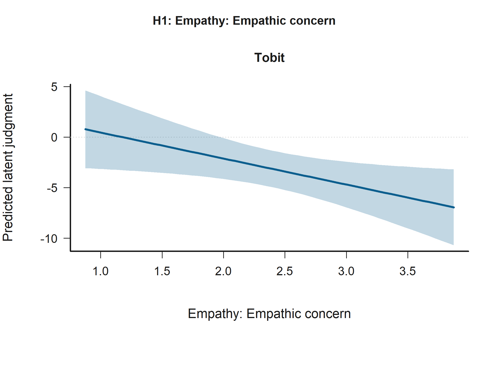
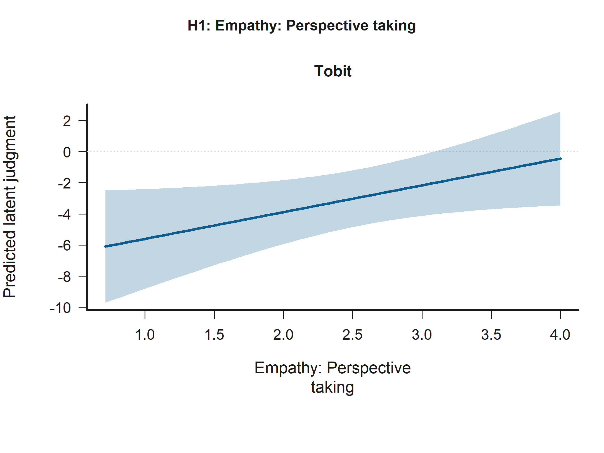
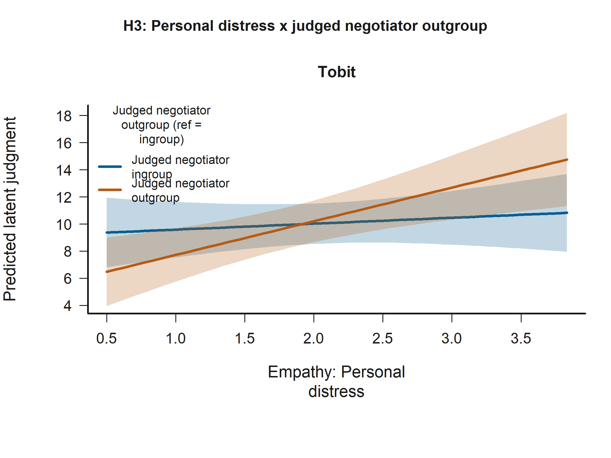
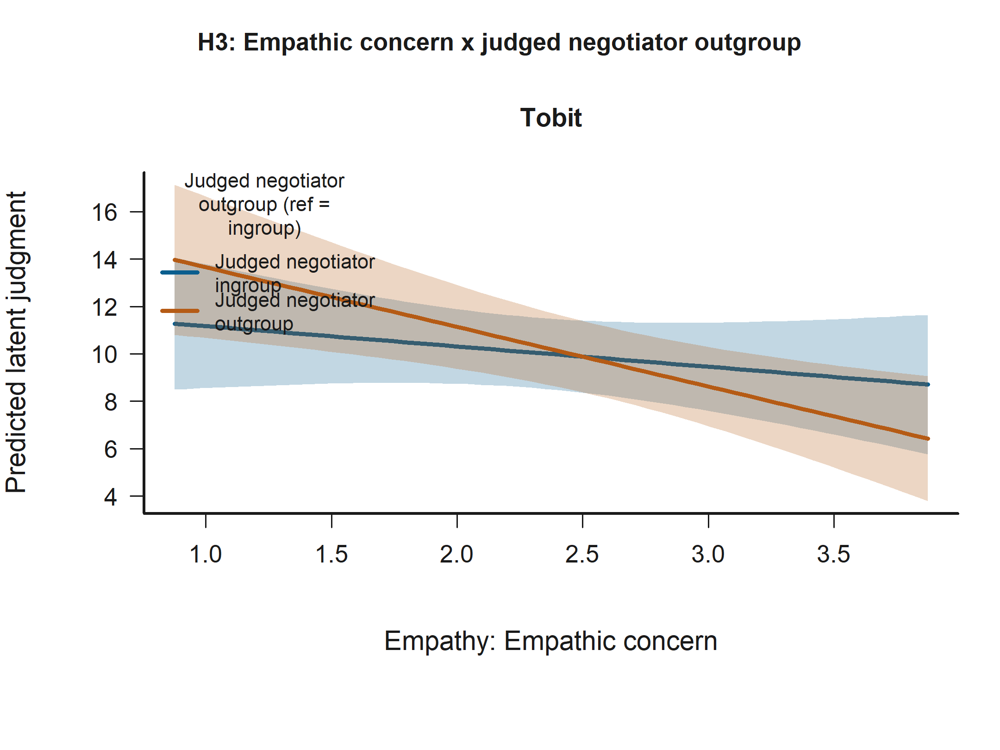
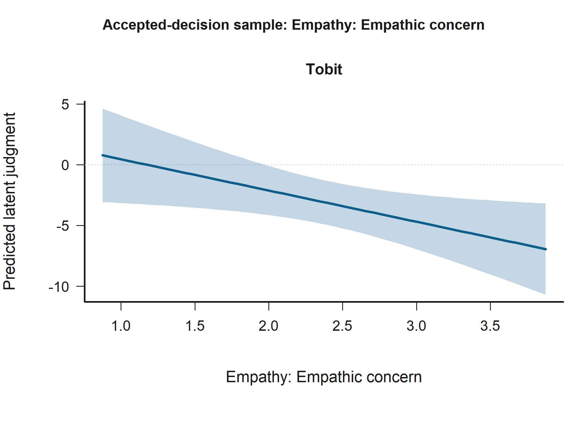
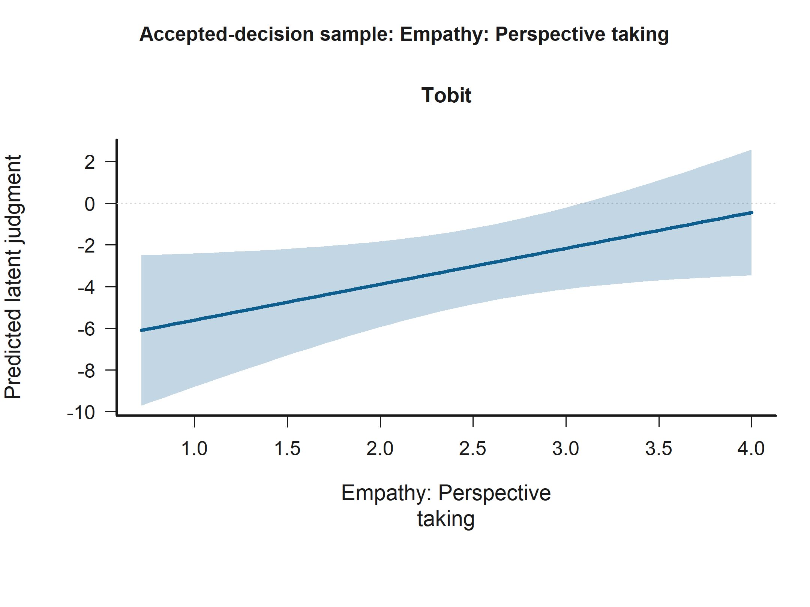
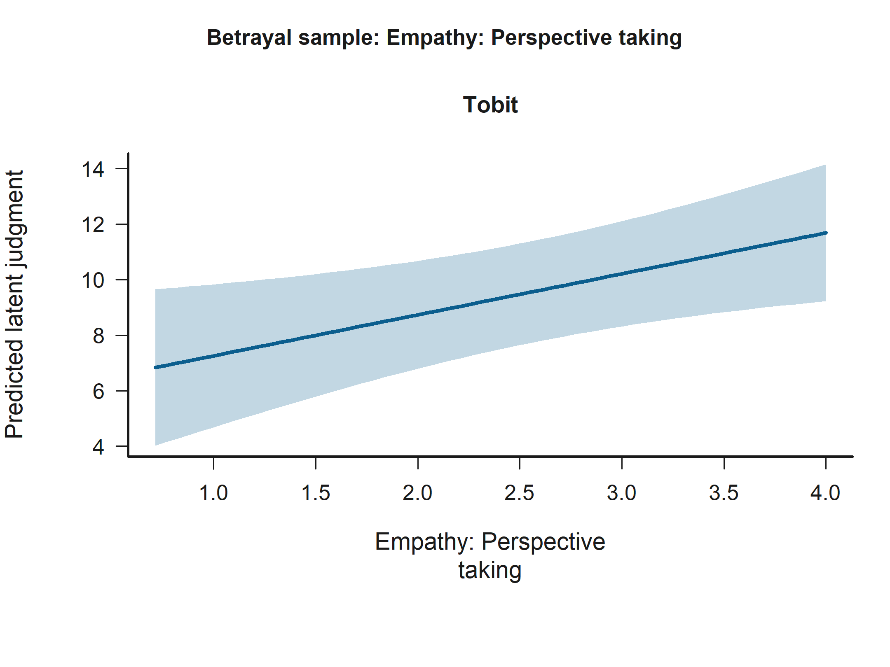
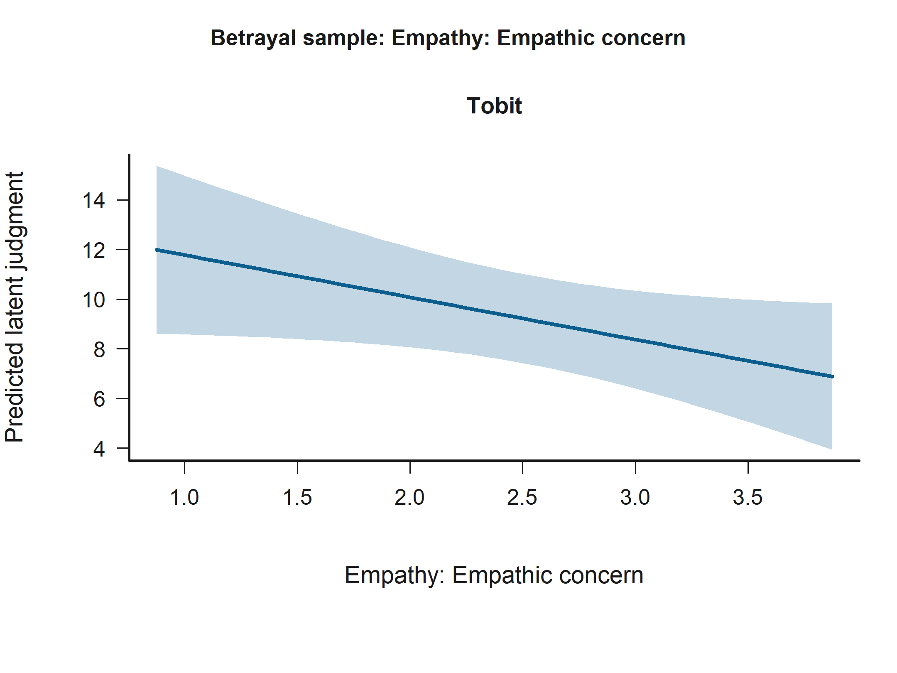
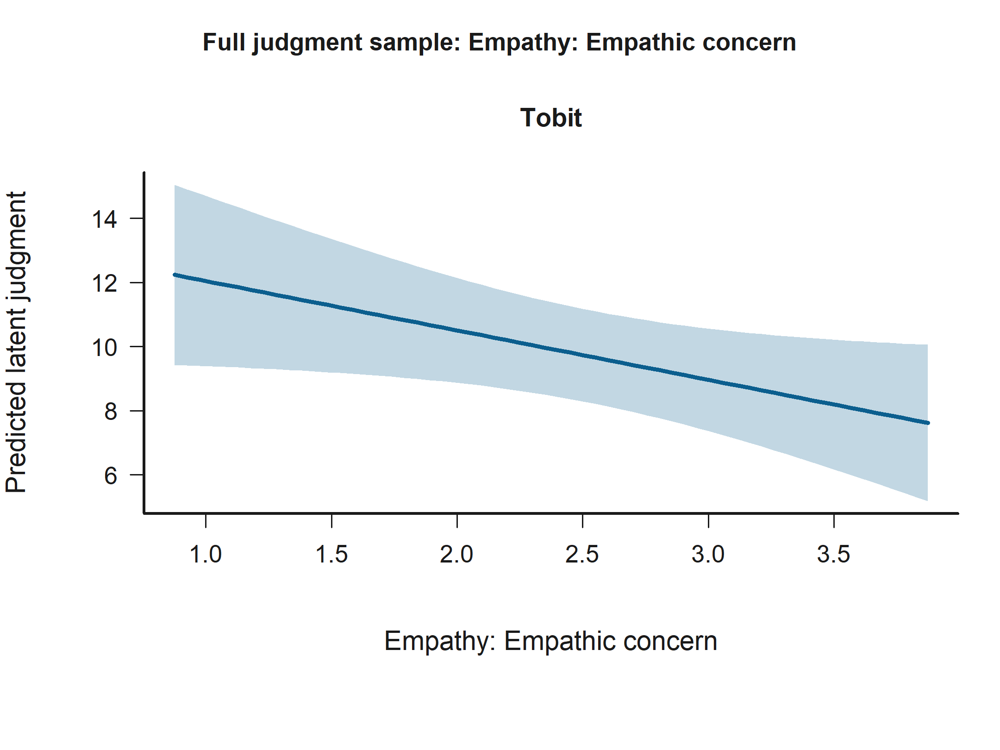
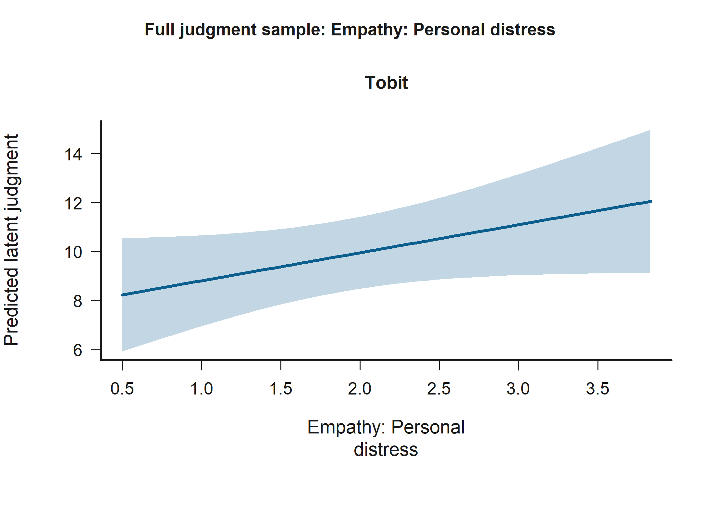

# Scientific Analysis of Moral Judgments with Tobit and Cluster-Aware Non-Parametric Robustness Checks

## Dataset Description
The empirical foundation of this project rests on two primary experimental datasets: FLORIDA and BUC.  The sample consists of students from the Bucaramanga Campus.  These datasets capture incentivized moral judgments from distinct socio-economic contexts. Participants were presented  with standardized negotiation scenarios where a negotiator's decision resulted in varying degrees of payoff for  themselves, their own group, and a victim group. Under  Option 2: judgment-level relational modeling , each judgment is treated as relational and linked both to a descriptive victim x negotiator scenario shorthand and to hypothesis-specific predictors for judged negotiator status, decision outcome, and additional relational controls.

## Option 2 Relational Case Configuration
Option 2 replaces isolated ingroup/outgroup indicators with explicit judgment-level relational variables built from the paired-group structure of each judgment. The analytic hypothesis models decompose that structure into the judged negotiator's relational status, decision outcome (Accept/Reject), their interaction, and additional relational controls for the counterpart negotiator and, in observer rows, victim alignment. All hypothesis sections are now interpreted through negotiator-level relational predictors rather than descriptive case labels.

## Hypothesis Significance Summary
Only hypothesis-relevant predictors with p < 0.10 are shown below. Symbols follow the rule `+` for p < 0.10, `*` for p < 0.05, `**` for p < 0.01, and `***` for p < 0.001. If bootstrap is disabled for a run, too few non-parametric bootstrap refits succeed, or the non-parametric fit does not converge, the non-parametric column reports that status explicitly. Dynamic figures are generated only for predictors that appear here with at least one significance symbol.
| Hypothesis | Tobit support | Non-parametric support |
| --- | --- | --- |
| H1 | Empathy: Empathic concern*; Empathy: Perspective taking* | None |
| H2 | None | None |
| H3 | Personal distress x judged negotiator outgroup**; Empathic concern x judged negotiator outgroup* | None |

## Significance-Driven Figures
Only hypothesis-relevant predictors that reach at least `p < .10` are visualized automatically. These figures rely on the saved Tobit and clustered non-parametric fits, and `id` remains only an inference-level clustering unit.

### H1: Empathy under relational controls

Empathy: Empathic concern is statistically significant in the Tobit model (*, p = 0.023). The figure below shows that across the observed range, higher Empathy: Empathic concern corresponds to lower predicted latent judgment.

Empathy: Perspective taking is statistically significant in the Tobit model (*, p = 0.045). The figure below shows that across the observed range, higher Empathy: Perspective taking corresponds to higher predicted latent judgment.

### H3: Empathy x judged-status moderation

Personal distress x judged negotiator outgroup is statistically significant in the Tobit model (**, p = 0.002). The figure below shows that the predicted relationship rises most sharply for Empathy: Personal distress when the condition is Judged negotiator outgroup.

Empathic concern x judged negotiator outgroup is statistically significant in the Tobit model (*, p = 0.025). The figure below shows that the predicted relationship falls most sharply for Empathy: Empathic concern when the condition is Judged negotiator outgroup.

## All Significant Predictors (p < .10)
The following figures extend beyond the hypothesis-target terms and visualize every predictor that reaches `p < .10` in the available H1-H3 Tobit or clustered non-parametric models. This includes significant controls such as age when they clear the threshold.

### Accepted-decision sample

Observer role (ref = victim) is statistically significant in:
- H1: Empathy under relational controls Model B (Tobit)
- H1: Empathy under relational controls Model A (Tobit)
The figure below shows that predicted latent judgment is higher for Observer role than for Victim role.

Empathy: Empathic concern is statistically significant in:
- H1: Empathy under relational controls Model B (Tobit)
The figure below shows that across the observed range, higher Empathy: Empathic concern corresponds to lower predicted latent judgment.

Age is statistically significant in:
- H1: Empathy under relational controls Model A (Tobit)
- H1: Empathy under relational controls Model B (Tobit)
The figure below shows that across the observed range, higher Age corresponds to higher predicted latent judgment.

Empathy: Perspective taking is statistically significant in:
- H1: Empathy under relational controls Model B (Tobit)
The figure below shows that across the observed range, higher Empathy: Perspective taking corresponds to higher predicted latent judgment.

Engineering participant (ref = humanities) is statistically significant in:
- H1: Empathy under relational controls Model A (Tobit)
- H1: Empathy under relational controls Model B (Tobit)
The figure below shows that predicted latent judgment is higher for Engineering participant than for Humanities participant.

### Betrayal sample

Negotiator accepted harmful deal is statistically significant in:
- H2: Judged-status x decision contrasts Model A (Tobit)
- H2: Judged-status x decision contrasts Model B (Tobit)
The figure below shows that predicted latent judgment is lower for Accept harmful deal than for Reject harmful deal.

Empathy: Perspective taking is statistically significant in:
- H2: Judged-status x decision contrasts Model B (Tobit)
The figure below shows that across the observed range, higher Empathy: Perspective taking corresponds to higher predicted latent judgment.

Socioeconomic status is statistically significant in:
- H2: Judged-status x decision contrasts Model A (Tobit)
- H2: Judged-status x decision contrasts Model B (Tobit)
The figure below shows that predicted latent judgment is higher for Socioeconomic status 5 than for Socioeconomic status 0.

Empathy: Empathic concern is statistically significant in:
- H2: Judged-status x decision contrasts Model B (Tobit)
The figure below shows that across the observed range, higher Empathy: Empathic concern corresponds to lower predicted latent judgment.

### Full judgment sample

Negotiator accepted harmful deal is statistically significant in:
- H2: Judged-status x decision contrasts Model B (Tobit)
- H3: Empathy x judged-status moderation Model B (Tobit)
- H2: Judged-status x decision contrasts Model A (Tobit)
- H3: Empathy x judged-status moderation Model A (Tobit)
The figure below shows that predicted latent judgment is lower for Accept harmful deal than for Reject harmful deal.

Personal distress x judged negotiator outgroup is statistically significant in:
- H3: Empathy x judged-status moderation Model B (Tobit)
The figure below shows that the predicted relationship rises most sharply for Empathy: Personal distress when the condition is Judged negotiator outgroup.

Empathy: Perspective taking is statistically significant in:
- H2: Judged-status x decision contrasts Model B (Tobit)
- H3: Empathy x judged-status moderation Model B (Tobit)
The figure below shows that across the observed range, higher Empathy: Perspective taking corresponds to higher predicted latent judgment.

Engineering participant (ref = humanities) is statistically significant in:
- H2: Judged-status x decision contrasts Model A (Tobit)
- H3: Empathy x judged-status moderation Model A (Tobit)
- H3: Empathy x judged-status moderation Model B (Tobit)
- H2: Judged-status x decision contrasts Model B (Tobit)
The figure below shows that predicted latent judgment is higher for Engineering participant than for Humanities participant.

Empathic concern x judged negotiator outgroup is statistically significant in:
- H3: Empathy x judged-status moderation Model B (Tobit)
The figure below shows that the predicted relationship falls most sharply for Empathy: Empathic concern when the condition is Judged negotiator outgroup.

Empathy: Empathic concern is statistically significant in:
- H2: Judged-status x decision contrasts Model B (Tobit)
The figure below shows that across the observed range, higher Empathy: Empathic concern corresponds to lower predicted latent judgment.

Socioeconomic status is statistically significant in:
- H3: Empathy x judged-status moderation Model A (Tobit)
- H2: Judged-status x decision contrasts Model A (Tobit)
The figure below shows that predicted latent judgment is higher for Socioeconomic status 5 than for Socioeconomic status 0.

Judged negotiator outgroup (ref = ingroup) is statistically significant in:
- H3: Empathy x judged-status moderation Model B (Tobit)
The figure below shows that predicted latent judgment is higher for Judged negotiator outgroup than for Judged negotiator ingroup.

Empathy: Personal distress is statistically significant in:
- H2: Judged-status x decision contrasts Model B (Tobit)
The figure below shows that across the observed range, higher Empathy: Personal distress corresponds to higher predicted latent judgment.

## Hypothesis Conclusion Summary
Each conclusion below is generated from the current coefficient outputs. Non-parametric statements are interpreted when participant-level cluster-bootstrap inference is available and are otherwise labeled explicitly.
- H1. Original hypothesis: Higher empathy predicts lower moral-judgment scores for harmful decisions after conditioning on judged-negotiator, counterpart, and observer-side victim relational controls. Tobit conclusion: the evidence is mixed but offers partial support for the hypothesis. Model A does not support the hypothesis; Empathy composite (average) is negative but not statistically significant (p = 0.492). Model B supports the hypothesis through Empathy: Empathic concern with a negative association (p = 0.023). Additional statistically significant signals include Observer role (ref = victim) with a positive association (p = 0.023) and Age with a positive association (p = 0.034). Non-parametric conclusion: no converged second-phase non-parametric model is available, so the robustness check is inconclusive for this hypothesis.
- H2a. Original hypothesis: Moral-judgment severity should vary with the judged negotiator's ingroup-versus-outgroup status, and that relational effect should depend on whether the harmful deal was accepted or rejected. Tobit conclusion: the available models do not support the hypothesis. Model A does not support the hypothesis; none of the judged-negotiator relational-status terms and their decision interaction in the non-control sample are statistically significant, and the closest signal is Judged negotiator outgroup (ref = ingroup) with a negative association (p = 0.706). Model B does not support the hypothesis; none of the judged-negotiator relational-status terms and their decision interaction in the non-control sample are statistically significant, and the closest signal is Accepted harmful deal x judged negotiator outgroup with a negative association (p = 0.896). Additional statistically significant signals include Negotiator accepted harmful deal with a negative association (p < 0.001) and Empathy: Perspective taking with a positive association (p = 0.012). Non-parametric conclusion: no converged second-phase non-parametric model is available, so the robustness check is inconclusive for this hypothesis.
- H2b. Original hypothesis: Moral-judgment severity should vary with the judged negotiator's ingroup-versus-outgroup-versus-control status, and that relational effect should depend on whether the harmful deal was accepted or rejected. Tobit conclusion: the available models do not support the hypothesis. Model A does not support the hypothesis; none of the judged-negotiator relational-status terms and their decision interaction in the full sample are statistically significant, and the closest signal is Accepted harmful deal x judged negotiator outgroup with a negative association (p = 0.396). Model B does not support the hypothesis; none of the judged-negotiator relational-status terms and their decision interaction in the full sample are statistically significant, and the closest signal is Accepted harmful deal x judged negotiator outgroup with a negative association (p = 0.291). Additional statistically significant signals include Negotiator accepted harmful deal with a negative association (p < 0.001) and Empathy: Perspective taking with a positive association (p = 0.005). Non-parametric conclusion: no converged second-phase non-parametric model is available, so the robustness check is inconclusive for this hypothesis.
- H3. Original hypothesis: The empathy effect may vary according to whether the judged negotiator is ingroup, outgroup, or control, while decision outcome and the additional relational controls remain explicitly modeled. Tobit conclusion: the evidence is mixed but offers partial support for the hypothesis. Model A does not support the hypothesis; none of the composite empathy x judged-negotiator relational-status interactions are statistically significant, and the closest signal is Empathy x judged negotiator outgroup with a negative association (p = 0.262). Model B supports the hypothesis through Personal distress x judged negotiator outgroup with a positive association (p = 0.002) and Empathic concern x judged negotiator outgroup with a negative association (p = 0.025). Additional statistically significant signals include Negotiator accepted harmful deal with a negative association (p < 0.001) and Empathy: Perspective taking with a positive association (p = 0.007). Non-parametric conclusion: no converged second-phase non-parametric model is available, so the robustness check is inconclusive for this hypothesis.

## PDF Comprehensive Report Generated
Please check `tobit_analysis_report.pdf` in the `outputs/report/` folder for the fully documented Tobit and cluster-aware non-parametric mathematical formulations, the Option 2 relational-variable logic, dual-estimator hypothesis testing, and the algorithmically interpreted natural language coefficients. When the run is dataset-specific, a matching alias such as `tobit_analysis_report_Buca.pdf` is also refreshed.

