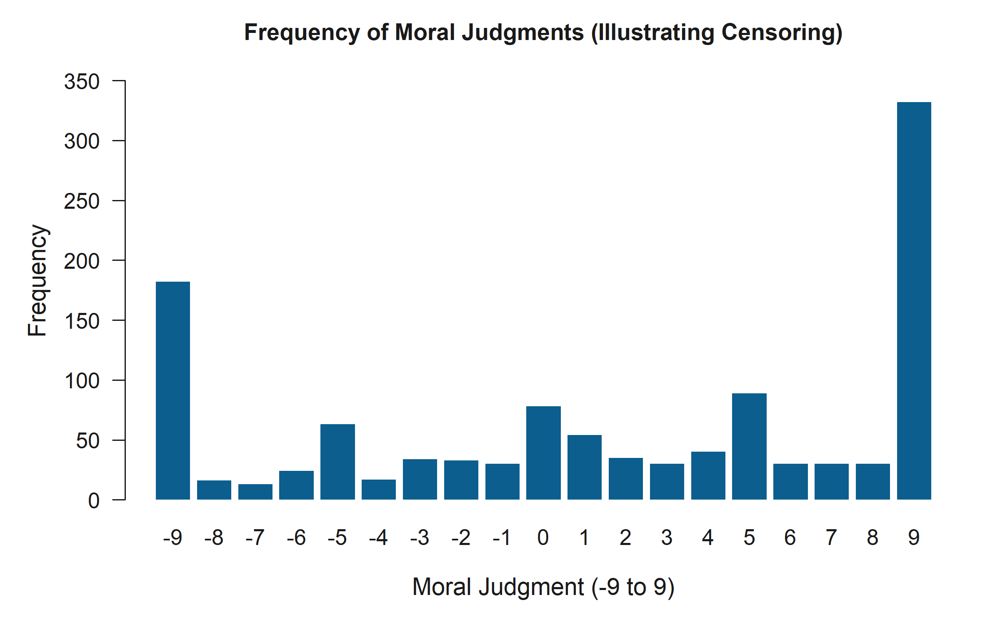
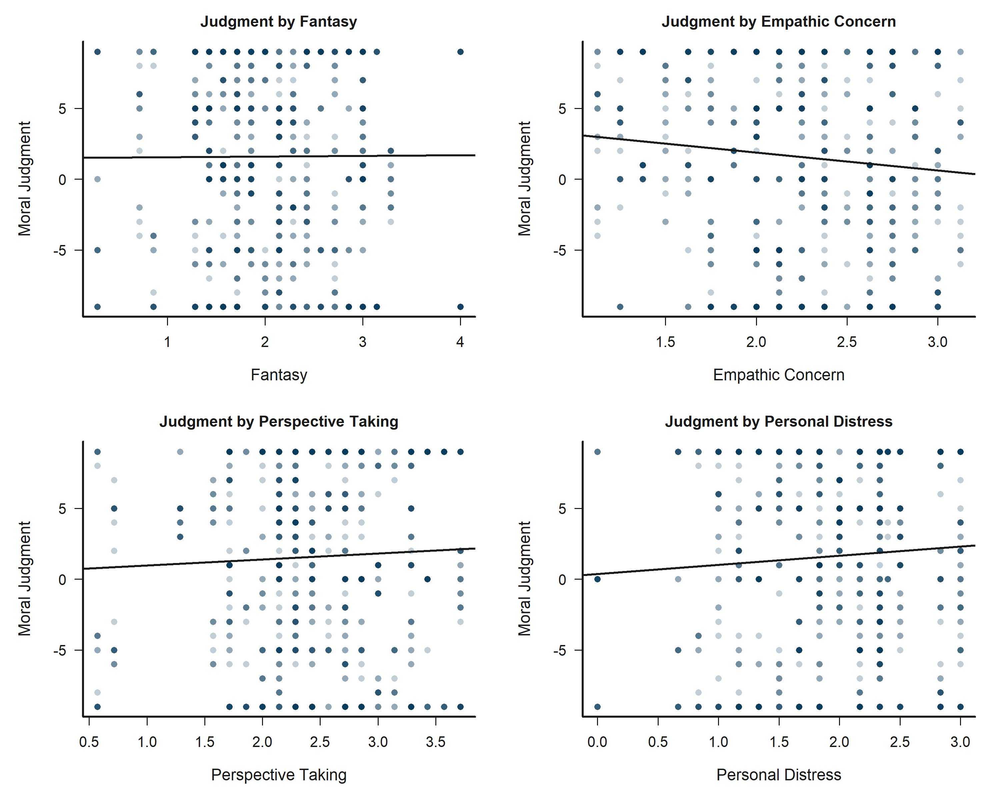
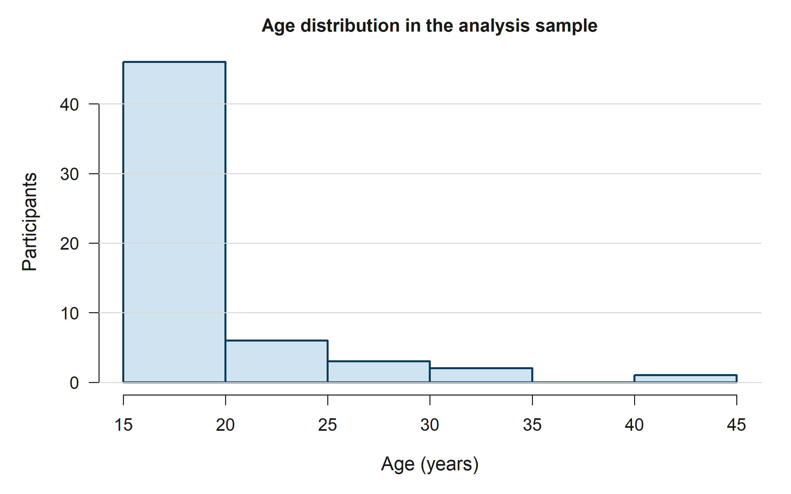
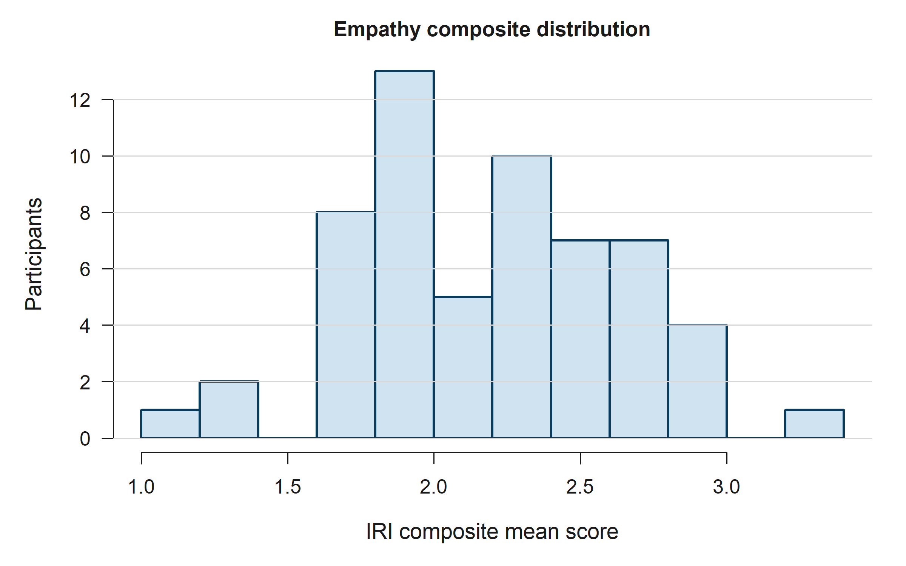
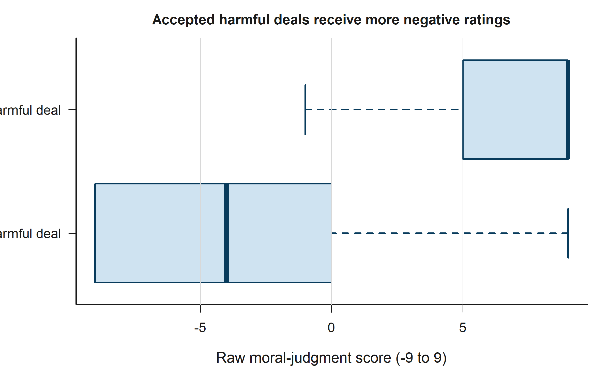
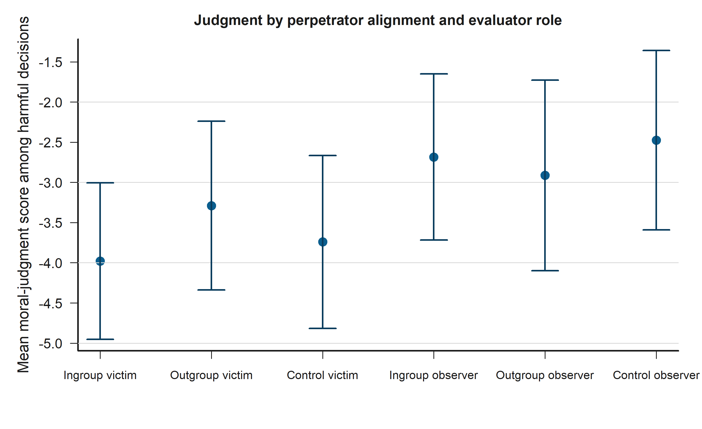

# Tobit Regression Pipeline Report

Generated on 2026-03-22 11:32 -05.

## Inputs
- Dataset: `data_final_FLORIDA.xlsx`
- Codebook: `datacard.md`
- Hypotheses source: `hypotheses.md`

## Analysis Design
- Unit of analysis: negotiator-level judgments (two judgments per stage, ten stages per participant).
- Primary outcome: the raw bounded judgment score `judgement`, observed from `-9` (acted very badly) to `9` (acted very well).
- Primary sample: participants passing both attention checks and with a non-missing empathy composite.
- Main hypothesis models are estimated on harmful decisions only (`decision_accept = 1`).
- The main Tobit specification uses `survival::survreg()` with participant-clustered robust standard errors and censoring at `-9` and `9`.
- H2a is operationalized as `same_group_harm = 1` when the negotiator and victim share the same labeled faculty.
- H2b and H3 are operationalized relative to the evaluator: `perp_outgroup = 1` when the negotiator belongs to the participant's outgroup.

## Word-Friendly Equations
Observed outcome definition for Word:
y_ij = -9 if y*_ij <= -9
y_ij = y*_ij if -9 < y*_ij < 9
y_ij = 9 if y*_ij >= 9

Main harmful-decision model for Word:
y*_ij = beta0 + beta1*IRI_i + beta2*OutgroupPerp_ij + beta3*ControlPerp_ij + beta4*VictimOutgroup_ij + beta5*(IRI_i*OutgroupPerp_ij) + beta6*(IRI_i*ControlPerp_ij) + gamma'*X_ij + e_ij

Same-group-harm model for Word:
y*_ij = alpha0 + alpha1*IRI_i + alpha2*SameGroupHarm_ij + alpha3*OutgroupPerp_ij + alpha4*VictimOutgroup_ij + delta'*X_ij + u_ij

Where:
IRI_i = standardized empathy composite
OutgroupPerp_ij = 1 if the negotiator belongs to the evaluator's outgroup
ControlPerp_ij = 1 if the negotiator's faculty label is hidden
VictimOutgroup_ij = 1 if the victim belongs to the evaluator's outgroup
SameGroupHarm_ij = 1 if negotiator and victim share the same labeled faculty
X_ij = observer role, participant faculty, sex, age, socioeconomic status, stage indicators, and negotiator-slot indicator

## Sample Overview
The workbook contains 63 participants, of whom 58 passed both attention checks. The primary analysis retains 58 participants and 1160 negotiator-level judgments. The Tobit hypothesis models focus on 569 harmful decisions in which a negotiator accepted the payoff-increasing but victim-harming deal.

| Metric | Value |
| --- | --- |
| Participants in workbook | 63.00 |
| Participants passing both attention checks | 58.00 |
| Participants in primary analysis | 58.00 |
| Mean age (analysis sample) | 20.29 |
| SD age (analysis sample) | 4.88 |
| Women in analysis sample | 27.00 |
| Men in analysis sample | 31.00 |
| Humanities in analysis sample | 27.00 |
| Engineering in analysis sample | 31.00 |
| Victim-first treatment in analysis sample | 29.00 |
| Observer-first treatment in analysis sample | 29.00 |

## Empathy Scale Summary
| Scale | Items | Mean | SD | Min | Max | Alpha |
| --- | --- | --- | --- | --- | --- | --- |
| IRI total | 28 | 2.196 | 0.448 | 1.036 | 3.250 | 0.767 |
| Fantasy | 7 | 2.111 | 0.723 | 0.286 | 4.000 | 0.644 |
| Empathic concern | 8 | 2.222 | 0.485 | 1.125 | 3.125 | 0.299 |
| Perspective taking | 7 | 2.488 | 0.665 | 0.571 | 3.714 | 0.597 |
| Personal distress | 6 | 1.918 | 0.635 | 0.000 | 3.000 | 0.521 |

## Package Availability
The local environment only has `survival` installed. `AER`, `VGAM`, and `censReg` are included as recommended alternatives in the documentation, but the fitted model below uses `survival::survreg()` because it supports clustered robust inference cleanly in this project.

| Package | Available |
| --- | --- |
| survival | TRUE |
| AER | TRUE |
| VGAM | TRUE |
| censReg | TRUE |

## Assumptions and Sample Size
The Tobit model is appropriate here because the observed dependent variable is bounded at -9 and 9 and the sample includes observations piled up at both limits. In the harmful-decision sample there are 569 negotiator-level observations from 58 participants. The observed censoring shares are 29.9% at the lower bound and 4.7% at the upper bound. Substantive interpretation assumes a latent continuous evaluation process, approximately normal model errors, and correct specification of the linear predictor. Inference is clustered by participant to address repeated judgments within persons, but the estimates should still be read cautiously because the participant count is modest.

## Exploratory Data Analysis
We first explore the raw dependent variable, showing its bounded nature and the piling up at the endpoints which justifies the Tobit approach.

Additionally, the following table and scatterplots summarize the relationship between moral judgments and each empathy subscale.

| Subscale | Pearson_r | P_value | CI_low | CI_high |
| --- | --- | --- | --- | --- |
| iri_total | 0.008 | 0.785 | -0.050 | 0.066 |
| iri_fs | 0.005 | 0.856 | -0.052 | 0.063 |
| iri_ec | -0.092 | 0.002 | -0.149 | -0.034 |
| iri_pt | 0.042 | 0.154 | -0.016 | 0.099 |
| iri_pd | 0.061 | 0.037 | 0.004 | 0.118 |

## Descriptive Patterns
The observed Tobit outcome is the raw moral-judgment score from -9 to 9, where lower values indicate harsher condemnation. Descriptively, accepted harmful deals receive much lower ratings than rejected deals (mean judgment -3.19 versus 6.21 ). Within the harmful-decision sample, same-faculty harm averages -3.55 judgment points compared with -2.91 for cross-faculty harm. Outgroup perpetrators average -3.12 judgment points versus -3.34 for labeled ingroup perpetrators.

| Metric | Value |
| --- | --- |
| Negotiator-level judgments in analysis sample | 1160.000 |
| Harmful decisions in primary model sample | 569.000 |
| Acceptance rate in analysis sample | 0.491 |
| Mean raw judgment for rejected decisions | 6.212 |
| Mean raw judgment for accepted decisions | -3.192 |
| Left-censored share at -9 in accepted sample | 0.299 |
| Right-censored share at 9 in accepted sample | 0.047 |

| negotiator_alignment | role | Observations | MeanJudgement | SDJudgement | SEJudgement | Lower95 | Upper95 |
| --- | --- | --- | --- | --- | --- | --- | --- |
| ingroup | victim | 95 | -3.979 | 4.842 | 0.497 | -4.953 | -3.005 |
| outgroup | victim | 97 | -3.289 | 5.278 | 0.536 | -4.339 | -2.238 |
| control | victim | 104 | -3.740 | 5.593 | 0.548 | -4.815 | -2.665 |
| ingroup | observer | 92 | -2.685 | 5.056 | 0.527 | -3.718 | -1.652 |
| outgroup | observer | 80 | -2.913 | 5.406 | 0.604 | -4.097 | -1.728 |
| control | observer | 101 | -2.475 | 5.723 | 0.569 | -3.591 | -1.359 |

### Figures

## Tobit Models
In the main harmful-decision Tobit model, higher empathy is associated with harsher judgments (b = -0.79, 95% CI [-2.86, 1.29], p = 0.457; not statistically distinguishable from zero). Outgroup perpetrators receive more favorable judgments than ingroup perpetrators (b = 0.08, 95% CI [-1.27, 1.44], p = 0.906; not statistically distinguishable from zero). The empathy slope becomes more negative in outgroup cases than ingroup cases (b = -0.45, 95% CI [-2.06, 1.16], p = 0.583; not statistically distinguishable from zero). In the same-faculty harm model, same-faculty harm is associated with harsher condemnation (b = -1.34, 95% CI [-2.88, 0.19], p = 0.087; not statistically distinguishable from zero).

### Main Harmful-Decision Tobit
| Term | Estimate | RobustSE | CI_Low | CI_High | PValue |
| --- | --- | --- | --- | --- | --- |
| Intercept | 0.508 | 5.090 | -9.468 | 10.484 | 0.921 |
| Empathy composite (z) | -0.788 | 1.059 | -2.864 | 1.288 | 0.457 |
| Outgroup perpetrator (ref = ingroup) | 0.082 | 0.691 | -1.272 | 1.436 | 0.906 |
| Control label hidden (ref = ingroup) | 0.139 | 0.807 | -1.443 | 1.721 | 0.863 |
| Victim outgroup (ref = ingroup) | -2.417 | 1.233 | -4.834 | -0.000 | 0.050 |
| Observer role (ref = victim) | 2.890 | 1.394 | 0.158 | 5.622 | 0.038 |
| Engineering participant (ref = humanities) | -1.279 | 1.801 | -4.808 | 2.251 | 0.478 |
| Man (ref = woman) | -1.821 | 1.761 | -5.273 | 1.631 | 0.301 |
| Age | -0.089 | 0.218 | -0.516 | 0.338 | 0.683 |
| Socioeconomic status | -0.435 | 0.760 | -1.923 | 1.054 | 0.567 |
| Stage 2 (ref = stage 1) | 0.769 | 1.056 | -1.301 | 2.840 | 0.466 |
| Stage 3 (ref = stage 1) | -1.132 | 1.450 | -3.973 | 1.710 | 0.435 |
| Stage 4 (ref = stage 1) | -2.214 | 1.528 | -5.208 | 0.781 | 0.147 |
| Stage 5 (ref = stage 1) | -1.788 | 1.250 | -4.238 | 0.662 | 0.153 |
| Stage 6 (ref = stage 1) | -0.749 | 1.348 | -3.391 | 1.893 | 0.578 |
| Stage 7 (ref = stage 1) | -1.454 | 1.237 | -3.878 | 0.970 | 0.240 |
| Stage 8 (ref = stage 1) | -3.178 | 1.407 | -5.936 | -0.421 | 0.024 |
| Stage 9 (ref = stage 1) | -2.733 | 1.358 | -5.394 | -0.071 | 0.044 |
| Stage 10 (ref = stage 1) | -1.122 | 1.359 | -3.787 | 1.542 | 0.409 |
| Negotiator 2 (ref = negotiator 1) | 0.002 | 0.485 | -0.948 | 0.953 | 0.996 |
| Empathy x outgroup perpetrator | -0.450 | 0.821 | -2.059 | 1.159 | 0.583 |
| Empathy x control label hidden | -0.450 | 0.733 | -1.887 | 0.987 | 0.539 |

### Same-Faculty Harm Tobit
| Term | Estimate | RobustSE | CI_Low | CI_High | PValue |
| --- | --- | --- | --- | --- | --- |
| Intercept | 4.054 | 5.531 | -6.788 | 14.895 | 0.464 |
| Empathy composite (z) | -0.873 | 0.953 | -2.740 | 0.994 | 0.359 |
| Negotiator and victim share faculty | -1.341 | 0.783 | -2.876 | 0.194 | 0.087 |
| Outgroup perpetrator (ref = ingroup) | -0.578 | 0.721 | -1.991 | 0.835 | 0.423 |
| Victim outgroup (ref = ingroup) | -1.847 | 1.534 | -4.854 | 1.160 | 0.229 |
| Observer role (ref = victim) | 2.294 | 1.520 | -0.685 | 5.272 | 0.131 |
| Engineering participant (ref = humanities) | -1.755 | 1.764 | -5.211 | 1.702 | 0.320 |
| Man (ref = woman) | -1.175 | 1.774 | -4.652 | 2.302 | 0.508 |
| Age | -0.213 | 0.227 | -0.659 | 0.233 | 0.349 |
| Socioeconomic status | -0.303 | 0.735 | -1.743 | 1.137 | 0.680 |
| Stage 2 (ref = stage 1) | -0.630 | 1.527 | -3.623 | 2.363 | 0.680 |
| Stage 3 (ref = stage 1) | -0.843 | 1.536 | -3.855 | 2.168 | 0.583 |
| Stage 4 (ref = stage 1) | -3.761 | 1.511 | -6.722 | -0.800 | 0.013 |
| Stage 5 (ref = stage 1) | -1.283 | 1.822 | -4.853 | 2.288 | 0.481 |
| Stage 6 (ref = stage 1) | -0.760 | 1.393 | -3.490 | 1.970 | 0.585 |
| Stage 7 (ref = stage 1) | -2.578 | 1.478 | -5.475 | 0.319 | 0.081 |
| Stage 8 (ref = stage 1) | -2.125 | 1.470 | -5.005 | 0.756 | 0.148 |
| Stage 9 (ref = stage 1) | -1.470 | 1.362 | -4.139 | 1.199 | 0.280 |
| Stage 10 (ref = stage 1) | -1.463 | 1.611 | -4.622 | 1.695 | 0.364 |
| Negotiator 2 (ref = negotiator 1) | -0.147 | 0.576 | -1.277 | 0.982 | 0.798 |

### Model Fit Summary
| Model | Observations | Participants | LowerBoundCensored | UpperBoundCensored | LogLik | AIC | PseudoR2 |
| --- | --- | --- | --- | --- | --- | --- | --- |
| Main harmful-decision Tobit | 569 | 58 | 170 | 27 | -1458.903 | 2963.805 | 0.014 |
| Same-faculty harm Tobit | 364 | 58 | 103 | 13 | -941.867 | 1925.733 | 0.013 |
| Full-sample Tobit | 1160 | 58 | 182 | 332 | -2627.999 | 5303.998 | 0.117 |

## Hypothesis Validation
Decision rule: reject H0 when p < 0.05; otherwise fail to reject H0. For the research hypothesis, 'Support HA' means the coefficient is statistically detectable and points in the theorized direction.

H1: Fail to reject H0; Insufficient evidence for HA. H1 is inconclusive: fail to reject the null. The coefficient direction is negative but the estimate is not statistically distinguishable from zero. H2a: Fail to reject H0; Insufficient evidence for HA. H2a is inconclusive: fail to reject the null. The coefficient direction is negative but the estimate is not statistically distinguishable from zero. H2b: Fail to reject H0; Insufficient evidence for HA. H2b is inconclusive: fail to reject the null. The coefficient direction is positive but the estimate is not statistically distinguishable from zero. H3: Fail to reject H0; Insufficient evidence for HA. H3 is inconclusive: fail to reject the null. The coefficient direction is negative but the estimate is not statistically distinguishable from zero.

| Hypothesis | Description | ModelTerm | Estimate | CI95 | PValue | Verdict | NullDecision | ResearchDecision | Interpretation |
| --- | --- | --- | --- | --- | --- | --- | --- | --- | --- |
| H1 | Higher empathy predicts lower moral-judgment scores for harmful decisions. | Empathy composite (z) | -0.788 | [-2.86, 1.29] | 0.457 | Inconclusive | Fail to reject H0 | Insufficient evidence for HA | H1 is inconclusive: fail to reject the null. The coefficient direction is negative but the estimate is not statistically distinguishable from zero. |
| H2a | Same-faculty harm receives lower moral-judgment scores than cross-faculty harm. | Negotiator and victim share faculty | -1.341 | [-2.88, 0.19] | 0.087 | Inconclusive | Fail to reject H0 | Insufficient evidence for HA | H2a is inconclusive: fail to reject the null. The coefficient direction is negative but the estimate is not statistically distinguishable from zero. |
| H2b | Outgroup perpetrators receive lower moral-judgment scores than ingroup perpetrators. | Outgroup perpetrator (ref = ingroup) | 0.082 | [-1.27, 1.44] | 0.906 | Inconclusive | Fail to reject H0 | Insufficient evidence for HA | H2b is inconclusive: fail to reject the null. The coefficient direction is positive but the estimate is not statistically distinguishable from zero. |
| H3 | Empathy becomes more negative in outgroup than ingroup cases. | Empathy x outgroup perpetrator | -0.450 | [-2.06, 1.16] | 0.583 | Inconclusive | Fail to reject H0 | Insufficient evidence for HA | H3 is inconclusive: fail to reject the null. The coefficient direction is negative but the estimate is not statistically distinguishable from zero. |

## Output Inventory
- `outputs/data/` contains participant-level and long-format analysis datasets.
- `outputs/tables/` contains all summary and hypothesis tables in CSV format.
- `outputs/models/` contains fitted Tobit models (`.rds`) plus coefficient and fit-stat CSV files.
- `outputs/figures/` contains 300 dpi minimalist figures using a high-contrast blue palette suitable for low-vision reading.
- `outputs/report/` contains the Markdown report, Word report, LaTeX article, PDF article, and session information.

